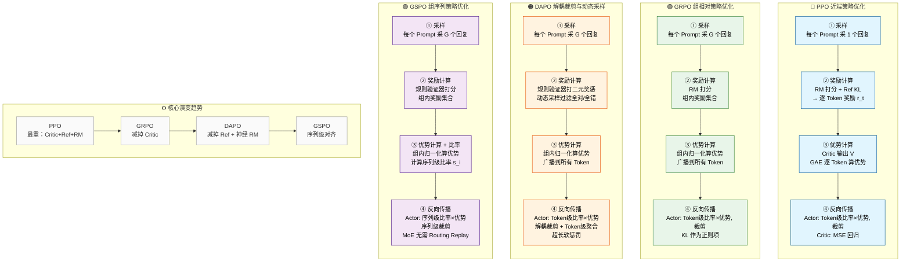

### PPO（近端策略优化）

- **模型**：actor、critic、ref、reward
- **流程**：
  1. **旧 actor model 采样**：从数据集中采样一批 Prompt，旧策略模型为每个 Prompt 生成 **1 个** 回复。
  2. **生成逐 token 奖励 \( r_t \)**：
     - Reward Model 对**完整回复**给出一个总分；
     - Ref Model 计算每个 token 的 KL 散度；
     - 将 RM 总分与 KL 惩罚结合，组装成 **逐 Token 的即时奖励序列 \( r_t \)**（通常 RM 总分只在最后一个 token 加入）。
  3. **旧 value model 估值**：旧 Critic 模型为每个 token 输出状态价值 \( V(s_t) \)。
  4. **计算 TD error**：\( \delta_t = r_t + \gamma \cdot V(s_{t+1}) - V(s_t) \)。
  5. **递推计算优势**：通过 GAE（\( A_t = \delta_t + \gamma\lambda \cdot A_{t+1} \)）反向递推得到优势 \( A_t \)。
  6. **合成回报目标**：\( \hat{R}_t = A_t + V(s_t) \)，作为 Critic 的**固定回归标签**（Stop-Gradient）。
  7. **Actor 反向传播**：最大化 PPO-clip 目标，`ratio = π_new / π_old`，Loss 为 `min(ratio·A, clip(ratio)·A)`，聚合方式为 **批次内 Token 级平均**（所有 Token 的 Loss 求和后除以总 Token 数）。
  8. **Critic 反向传播**：最小化 MSE 损失 \( \|V_{\text{new}}(s_t) - \hat{R}_t\|^2 \)，让 Critic 的预测向回报目标靠拢。

---

### GRPO（组相对策略优化）

- **模型**：actor、ref、reward（**无 Critic**）
- **流程**：
  1. **旧 actor model 采样**：从数据集中采样一批 Prompt，旧策略模型为每个 Prompt 生成 **一组（Group，通常 \( G=64 \)）** 回复。
  2. **组内打分**：Reward Model 对组内每个完整回复独立打分，得到奖励集合 \( \{r_1, r_2, ..., r_G\} \)。
  3. **组内相对优势估计**：将组内奖励归一化（减去均值除以标准差），得到每个回复的相对优势 \( \hat{A}_i \)，然后将该标量值**广播（Broadcast）** 给该回复中的所有 token（即同一回复内所有 token 共享相同的优势值）。
  4. **Actor 反向传播**：使用 PPO-clip 风格的目标函数，但重要性比率为 Token 级 \( w_{i,t} = \frac{\pi_\theta}{\pi_{\theta_{old}}} \)。损失聚合方式为 **先 Token 平均，再样本平均**（即先对每个回复内的 Token Loss 求平均，再对组内 G 个回复求平均）。无 Critic，无 GAE。

---

### DAPO（解耦裁剪与动态采样策略优化）

- **模型**：actor、reward（**无 critic，无 ref，无 KL 惩罚**）
- **流程**：
  1. **旧 actor model 采样**：从数据集中采样一批 Prompt，旧策略模型为每个 Prompt 生成 **一组（Group，如 \( G=16 \)）** 回复。
  2. **规则验证器打分**：直接使用**规则（Rule-based）** 验证最终答案正确性，对组内每个完整回复打出二元奖励 \( r_i \in \{+1, -1\} \)（**无 Reward Model，无 KL 散度**）。
  3. **动态采样过滤（Dynamic Sampling）**：**只保留组内“既有正确又有错误”的 Prompt 组**（过滤掉全对或全错的样本），确保该组样本拥有非零梯度和有效学习信号。
  4. **组内相对优势估计**：将过滤后组内的奖励归一化（减均值除标准差），得到每个回复的相对优势 \( \hat{A}_i \)，并**广播**给该回复内的所有 Token。
  5. **Actor 反向传播（核心改进）**：
     - **裁剪边界解耦（Clip-Higher）**：上下裁剪阈值不对称（\( \epsilon_{\text{low}}=0.2 \)，\( \epsilon_{\text{high}}=0.28 \)），**提高上界**为低概率“探索性”Token 留下更多提升空间，对抗熵崩溃。
     - **Token 级损失聚合**：Loss 聚合方式为 **批次内 Token 级平均**（与 PPO 相同，所有 Token 的 Loss 求和后除以总 Token 数），使长序列中每个 Token 获得等权重更新，解决 GRPO 样本级平均导致的长序列 Token 稀释问题。
     - **超长软惩罚（Overlong Reward Shaping）**：对接近长度上限的回复施加**线性软惩罚**（越长扣分越多），而非统一负奖励，消除截断噪声。

---

### GSPO（组序列策略优化）

- **模型**：actor、reward（**无 critic，通常无 ref/KL**）
- **流程**：
  1. **旧 actor model 采样**：从数据集中采样一批 Prompt，旧策略模型为每个 Prompt 生成 **一组（Group）** 回复。
  2. **验证器打分**：对组内每个完整回复打出奖励 \( r_i \)，获得组内奖励集合。
  3. **组内相对优势估计**：将组内奖励归一化（减均值除标准差），得到每个回复的序列级优势 \( \hat{A}_i \)。
  4. **序列级重要性比率计算（核心创新）**：
     - 将重要性比率从 **Token 级**（GRPO 的 \( w_{i,t} \)）提升为 **序列级**（Sequence-level）：
       \[
       s_i(\theta) = \left( \frac{\pi_\theta(y_i|x)}{\pi_{\theta_{\text{old}}}(y_i|x)} \right)^{1/|y_i|}
       \]
     - 引入 **长度归一化**（\( 1/|y_i| \) 次方），消除长序列因连乘导致的数值极端膨胀，使不同长度的比率具有可比性。
  5. **Actor 反向传播（核心改进）**：
     - **序列级裁剪（Sequence-level Clipping）**：直接对**整个回复**的单一比率 \( s_i \) 进行裁剪（裁剪粒度为整个序列，而非单个 Token）。若比率超限，**整条回复的所有 Token 被整体隔离**，不参与梯度更新。
     - **序列级优化**：优化基本单位从 Token 提升为**整个序列**，完美对齐“奖励给予整个回复”的物理逻辑，从根源上消除 Token 级重要性采样的高方差噪声累积，使 MoE 模型无需复杂的 Routing Replay 策略即可稳定收敛。

---

### 四大算法流程图风格总结对比

| 步骤 | **PPO** | **GRPO** | **DAPO** | **GSPO** |
| :--- | :--- | :--- | :--- | :--- |
| **① 采样** | 每个 Prompt 采 **1** 个回复 | 每个 Prompt 采 **G** 个回复 | 每个 Prompt 采 **G** 个回复 | 每个 Prompt 采 **G** 个回复 |
| **② 奖励来源** | RM 总分 + KL 惩罚 | RM 或规则打分 | **规则验证器**（二元奖惩，无 KL） | 验证器打分（无 KL） |
| **③ 优势计算** | GAE（依赖 Critic 的 V） | 组内奖励归一化 | **组内归一化 + 动态采样过滤**（过滤全对/全错） | 组内奖励归一化 |
| **④ 重要性比率** | Token 级 \( w_{i,t} \) | Token 级 \( w_{i,t} \) | Token 级 \( w_{i,t} \)（继承 GRPO） | **序列级 \( s_i \)**（**长度归一化**） |
| **⑤ 裁剪机制** | Token 级对称裁剪 | Token 级对称裁剪 | **解耦裁剪**（\( \epsilon_{\text{low}}<\epsilon_{\text{high}} \)） | **序列级裁剪**（整条回复整体裁剪） |
| **⑥ Loss 聚合** | **Token 级平均** | **先 Token 平均，再样本平均** | **Token 级平均**（对抗长 Token 稀释） | **序列级平均**（无 Token 内平均） |
| **⑦ 额外机制** | Critic 回归 MSE | KL 作为正则项加入 Loss | **超长软惩罚** | **无需 Routing Replay**（MoE 天生稳定） |
| **核心模型** | Actor + Critic + Ref + Reward | Actor + Ref + Reward | **Actor + Reward**（非神经网络 RM） | **Actor + Reward**（非神经网络 RM） |

---

---