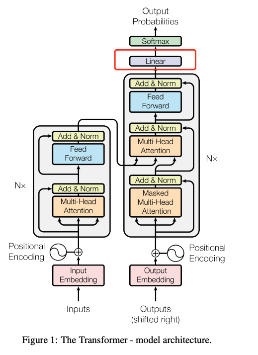
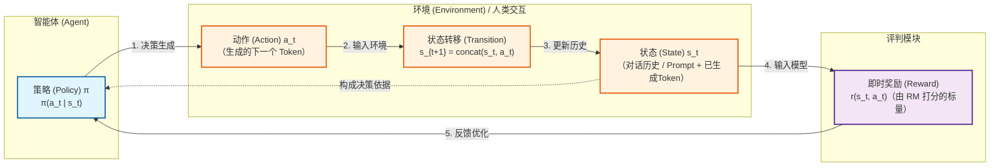
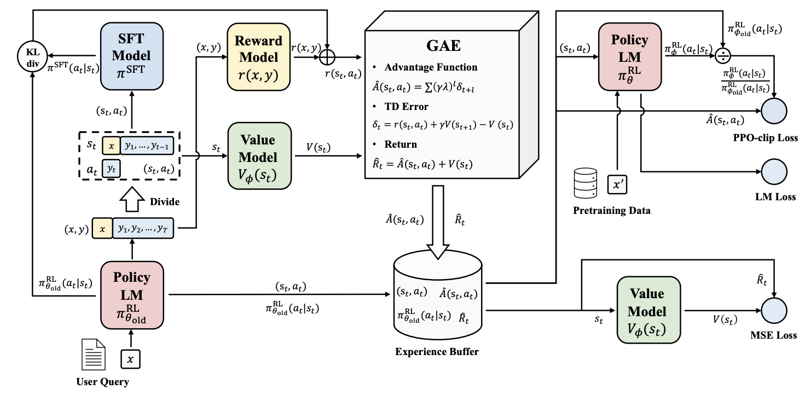
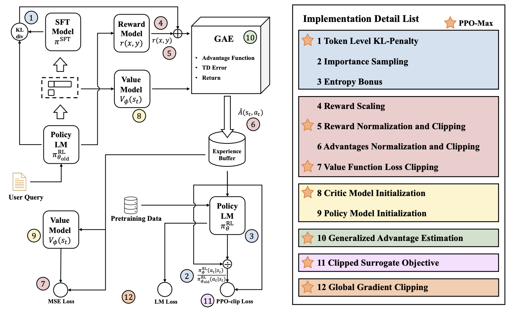

论文《Secrets of RLHF in Large Language Models Part I: PPO》详解
---

### 3.1 奖励建模（Reward Modeling）

奖励模型（Reward Model, RM）是 RLHF 流程中的“人类偏好代理器”。其核心目标是将人类对文本回复的抽象偏好，转化为可量化的标量信号，从而为后续的强化学习提供优化方向。

#### 3.1.1 模型架构

论文中RM的构建方式：

- **骨干网络**：采用基于Transformer的预训练语言模型。
- **头部改造**：
  1.  移除原始模型的最后一层 **解嵌入层（unembedding layer）**，该层原本用于将隐藏状态映射为词表大小的概率分布（logits）。
  2.  在最终的 Transformer 层之上，**额外添加一个线性层（Linear Layer）**，该层将高维隐藏状态映射为 **1 维标量值（Scalar）**。
- **评分机制**：模型接收完整的文本序列（包括提示词和回复）后，仅对 **最后一个 Token（即序列结束符或最终位置）** 的隐藏状态进行映射，输出一个标量分数 \(r(x, y)\)。该分数直接表示当前回复的质量，分数越高代表模型判定该回复越符合人类偏好。

**（Transformer架构图引自：Attention Is All You Need）**

#### 3.1.2 基础损失函数

- **数据格式**：训练数据 \(\mathcal{D}_{\text{rm}}\) 由三元组构成，即同一输入提示 \(x\) 对应的两个回复：\(y_w\)（偏好/胜出回复，preferred）和 \(y_l\)（劣质/败出回复，dispreferred）。
- **建模思想（Bradley-Terry 模型）**：RM 不需要绝对精准地预测人类打分，只需正确区分同一问题下两个回复的相对好坏。理想情况下，偏好回复的得分 \(r(x, y_w)\) 应显著大于劣质回复的得分 \(r(x, y_l)\)。
- **基础损失函数**：
  \[
  \mathcal{L}(\psi) = -\log \sigma \big( r_\psi(x, y_w) - r_\psi(x, y_l) \big)
  \tag{1}
  \]
  - 其中 \(\sigma\) 为 Sigmoid 函数，将得分差值压缩至 \((0, 1)\) 区间，可视作模型判定 \(y_w\) 优于 \(y_l\) 的概率。
  - 采用负对数似然（Negative Log-Likelihood）作为损失，当差值越大（模型判断越正确），损失值越小；反之若差值趋向负无穷（判断错误），损失值急剧增大。这本质上是一个二分类的排序损失（Pairwise Ranking Loss）。

#### 3.1.3 引入模仿学习的混合损失

论文指出，仅使用公式（1）的排序损失可能导致模型丢失预训练阶段获得的文本生成能力。为此，作者参考Askell等人的工作，在RM训练中引入了**模仿学习（Imitation Learning）** 辅助项。

- **辅助目标**：在每一对偏好数据中，额外加入针对 **偏好回复 \(y_w\)** 的自回归语言模型（LM）损失。
- **实现细节**：模型保留一个与 \(r\) 共享底层 Transformer 的“兄弟头” \(r'\)，该头部的输出维度对应词表大小，用于计算下一个 Token 的预测概率 \(\log r'(x, y_w)\)。
- **最终复合损失函数**：
  \[
  \mathcal{L}(\psi) = -\lambda \mathbb{E}_{(x,y_w,y_l)\sim \mathcal{D}_{\mathrm{rm}}} \big[ \log \sigma (r(x,y_w) - r(x,y_l)) \big] + \beta_{\mathrm{rm}} \mathbb{E}_{(x,y_w)\sim \mathcal{D}_{\mathrm{rm}}} \big[ \log (r'(x,y_w)) \big]
  \tag{2}
  \]
  - **第一项（排序损失）**：系数为 \(\lambda\)，负责让模型学会区分优劣回复。注：\(\mathbb{E}\)仅作用于Batch维度。
  - **第二项（LM 损失）**：系数为 \(\beta_{\mathrm{rm}}\)，负责让模型在提取特征用于打分的同时，不忘记如何生成流畅、通顺的文本。该辅助项有效稳定了 RM 的训练，防止因过度关注判别能力而导致的表征坍缩。注：\(\mathbb{E}\)作用于Batch和Token维度。

#### 3.1.4 训练时的 KL 散度约束

提前引入后续强化学习阶段使用的 **总奖励公式**，该公式揭示了奖励分数与策略约束之间的数学关系：

\[
r_{\mathrm{total}}(x, y) = r(x, y) - \eta \cdot \mathrm{KL}\big( \pi_{\phi}^{\mathrm{RL}}(y|x) \;\|\; \pi^{\mathrm{SFT}}(y|x) \big)
\tag{3}
\]

- 虽然该公式主要作用于第三阶段的 PPO 更新，但在原理上它限定了 RM 打分的使用边界：强化学习中的实际优化目标并非单纯追逐 RM 给出的原始高分 \(r(x, y)\)，而是要减去策略模型 \(\pi_{\phi}^{\mathrm{RL}}\) 与初始 SFT 模型 \(\pi^{\mathrm{SFT}}\) 之间的 KL 散度。
- **双重作用**：
  (1).  **充当熵奖励**：鼓励策略模型保持一定的生成多样性，避免退化。
  (2).  **充当信任域约束**：防止策略模型为了“欺骗”RM 获得异常高分，而生成分布外（OOD）、语法混乱或语义重复的文本。

---

### 3.2 强化学习（Reinforcement Learning）

引言将**大语言模型（LLM）的对话生成问题**形式化为一个**马尔可夫决策过程（MDP）**，为后续的策略优化奠定数学基础。

#### (1) 环境建模（Environment Modeling）
- **环境（Environment）**：论文将人类交互（human interaction）视为强化学习中的“环境”。这意味着智能体无法通过内部模拟获得奖励，必须依赖外部（人类或代理奖励模型）的反馈。
- **状态（State）**：\(s_t\)。定义为截至 \(t\) 时刻的全部对话历史（包含用户和助手双方的所有文本）。在 token 层面，它是输入提示（Prompt）与所有已生成 Token 的拼接序列。
- **动作（Action）**：\(a_t\)。定义为在当前状态下，智能体（AI 助手）生成的下一个 Token。
- **策略（Policy）**：\(\pi\)。即智能体在给定状态 \(s_t\) 下选择动作 \(a_t\) 的概率分布。
- **状态转移（Transition）**：智能体采取动作 \(a_t\)（生成 Token）后，环境将其追加到对话历史中，形成新的状态 \(s_{t+1}\)。
- **即时奖励（Reward）**：\(r(s_t, a_t)\)。它是由训练好的奖励模型（Reward Model）依据当前状态和生成动作计算出的标量反馈信号。

#### (2) 优化目标（Objective）
智能体的最终目标是找到最优策略，以最大化一条完整轨迹 \(\tau = \{s_1, a_1, \ldots, s_T, a_T\}\) 上的**累积回报（Return）**。论文给出了两种形式的回报定义：

1.  **有限视野无折扣回报（Finite-horizon Undiscounted Return）**：
   \[
   R(\tau) = \sum_{t=1}^{T} r(s_t, a_t)
   \]
   适用于有明确终止长度（如固定最大生成长度）的对话场景，直接累加每一步的奖励。

2.  **无限视野折扣回报（Infinite-horizon Discounted Return）**：
   \[
   R(\tau) = \sum_{t=0}^{\infty} \gamma^t r(s_t, a_t)
   \]
   其中 \(\gamma \in (0, 1)\) 为折扣因子。在 LLM 生成任务中，通常采用此形式，使得模型在优化长期回报时，更侧重于近期决策（因为 \(\gamma^t\) 随时间指数衰减）。

### 3.2.1 策略梯度方法（Policy Gradient Methods）

策略梯度方法是解决上述连续决策问题的核心算法族。与基于价值的方法（如 DQN）不同，它不依赖先估计价值函数再导出策略，而是直接对策略 \(\pi\) 的参数 \(\theta\) 进行优化。为了实现这一优化，我们首先需要明确该策略在数学上的优化目标——即如何量化“当前策略的好坏”。为此，我们引入以下两个关键定义：

*   **\(R\) (Return / 回报)**：对**一条具体轨迹** \(\tau\) 的“总得分”。它衡量的是**一次特定的、已经完成的交互**是好是坏。例如，模型针对一个提示生成了一个回复，并获得了一个分数，这个分数就是该次交互的回报 \(R\)。
*   **\(J(\theta)\) (Performance Objective / 性能目标)**：这是对**所有可能轨迹**的“期望得分”。它衡量的不是某一次交互，而是当前策略 \(\pi_\theta\) **平均而言**能获得多少回报。

- 它们之间的关系可以通过以下公式来定义：
\[
J(\theta) \triangleq \mathbb{E}_{\tau \sim \pi_\theta}[R(\tau)]
\]
也就是说，\(J(\theta)\) 是回报 \(R(\tau)\) 在**所有可能的轨迹 \(\tau\)** 上的**期望值（平均值）**。

#### (1) 基本思想与参数化
- **参数化策略**：策略 \(\pi\) 由参数 \(\theta\) 控制，记为 \(\pi_\theta(a|s)\)（或 \(\pi(a|s, \theta)\)），表示在状态 \(s\) 下选择动作 \(a\) 的条件概率。
- **性能目标**：定义 \(J(\theta)\) 为遵循策略 \(\pi_\theta\) 时的**期望回报（Expected Return）**。
- **更新规则**：
  \[
  \theta \leftarrow \theta + \alpha \nabla_{\theta} J(\theta)
  \tag{4}
  \]
  其中 \(\alpha\) 为学习率。注：参数沿着**策略梯度上升**的方向更新，以最大化期望回报。

#### (2) 计算策略梯度
梯度 \(\nabla_\theta J(\theta)\) 无法直接解析计算，但可通过**似然比技巧（Likelihood Ratio Trick）**转化为可采样的期望形式：
\[
\nabla_{\theta}J(\theta) = \mathbb{E}_{\tau \sim \pi_{\theta}}\left[\sum_{t = 0}^{T}\nabla_{\theta}\log \pi_{\theta}(a_t|s_t)\Phi_t\right]
\tag{5}
\]

其中 \(\tau \sim \pi_\theta\) 表示轨迹服从当前策略的采样分布。\(\Phi_t\) 称为**累积奖励估计量**（详见3.2.2）。

#### 第一步：理解公式的“宏观任务”
- **宏观目标**：计算**策略参数 \(\theta\) 的更新方向（梯度）**。
- **输入数据**：当前策略 \(\pi_\theta\) 与环境交互采样得到的一批轨迹（Trajectories） \(\tau\)。
- **输出结果**：一个与 \(\theta\) 形状完全相同的梯度张量，用于执行 \(\theta \leftarrow \theta + \alpha \cdot \text{(结果)}\)。

#### 第二步：从右向左拆解计算项
#### 1. 计算 \(\log \pi_\theta(a_t|s_t)\)（对数概率）
- **操作对象**：状态 \(s_t\)（当前已生成的文本前缀）和动作 \(a_t\)（你实际采样的那个 Token）。
- **数学操作**：将 \(s_t\) 喂入模型，模型输出词表上的概率分布，取出对应 \(a_t\) 的那个概率值，再取自然对数。

#### 2. 计算单步加权梯度
- **操作对象**：轨迹中单个时间步 \(t\) 的状态-动作对 \((s_t, a_t)\)，以及该步对应的累计奖励估计量 \(\Phi_t\)。
- **数学操作**：将对数概率 \(\log \pi_\theta(a_t|s_t)\) 对参数 \(\theta\) 求梯度，再乘以该步的权重系数 \(\Phi_t\)，得到该时刻的**独立梯度贡献量**。
- **计算规则**：
  \[
  \text{Grad}_t = \Phi_t \cdot \nabla_{\theta} \log \pi_\theta(a_t|s_t)
  \]
- **参数\(\theta\)更新原理**：
如果 \(\frac{\partial \log \pi}{\partial \theta_i} > 0\)，意味着： **在当前状态 \(s_t\)（文本前缀）下，如果把参数 \(\theta_i\) 单独调大一点点（增加该权重的数值），模型生成当前动作 \(a_t\)（这个具体的 Token）的概率 \(\pi\) 就会上升。** 反之，如果梯度小于 0，意味着调大这个权重反而会降低该 Token 的概率。因此：
> **（1）当 \(\Phi_t > 0\)（好动作）**：
> 采用**强化**策略。参数更新方向与梯度方向相同。这意味着：原来对生成该 Token 起促进作用的权重（正梯度）会被**增大**；原来对生成该 Token 起抑制作用的权重（负梯度）会被**减小**。这种双向微调使得该 Token 在下一次遇到相同上下文时，**被抽中的概率必然上升**，从而将决策路径推向高奖励区域，使 \(J(\theta)\) 增大。
>
> **（2）当 \(\Phi_t < 0\)（坏动作）**：
> 采用**惩罚**策略。参数更新方向与梯度方向相反（乘以负数）。这意味着：原来对生成该 Token 起促进作用的权重会被**减小**；原来对生成该 Token 起抑制作用的权重会被**增大**。这种反向操作使得该 Token 的生成概率**被强行压低**，从而减少低奖励路径的出现，使整体的 \(J(\theta)\) 向更高处偏移。

| 前提条件 | 权重的原始梯度符号 | \(\Phi_t\) 的符号 | 权重更新量 \(\Delta \theta_i\) 的符号 | **对权重 \(\theta_i\) 的具体操作** | 对该 Token 概率的影响 |
| :--- | :--- | :--- | :--- | :--- | :--- |
| ① 好动作，且权重有正向影响 | \( \nabla_{\theta_i} > 0 \) | \( \Phi_t > 0 \) | **正 × 正 = 正** | **\(\theta_i\) 增大（向右拧）** | **概率上升**（强化） |
| ② 好动作，但权重有负向影响 | \( \nabla_{\theta_i} < 0 \) | \( \Phi_t > 0 \) | **正 × 负 = 负** | **\(\theta_i\) 减小（向左拧）** | **概率上升**（强化） |
| ③ 坏动作，但权重有正向影响 | \( \nabla_{\theta_i} > 0 \) | \( \Phi_t < 0 \) | **负 × 正 = 负** | **\(\theta_i\) 减小（向左拧）** | **概率下降**（抑制） |
| ④ 坏动作，且权重有负向影响 | \( \nabla_{\theta_i} < 0 \) | \( \Phi_t < 0 \) | **负 × 负 = 正** | **\(\theta_i\) 增大（向右拧）** | **概率下降**（抑制） |

#### 3. 单条轨迹内的梯度聚合（对应 \(\sum_{t=0}^{T}\)）

- **操作对象**：同一条轨迹（即同一个 Prompt 生成的一句完整回复）内的所有 Token。
- **数学操作**：将该轨迹内 **每一个时间步 \(t\)** 计算出的加权梯度向量，**按元素累加（求和）**，得到该轨迹的“总梯度向量” \(g_i\)。
- **计算规则**：
  \[
  g_i = \sum_{t=0}^{T} \left( \Phi_t \cdot \nabla_{\theta} \log \pi_\theta(a_t|s_t) \right)
  \]
- **物理意义**：将一句话中几十个 Token 各自的“微调建议”合并为一个统一的“总建议”。形成一个总的梯度方向 \(g_i\)。

#### 4. 处理 \(\mathbb{E}_{\tau \sim \pi_{\theta}}\)（期望 / 批次平均）

- **操作对象**：当前批次（Batch）中的所有独立轨迹（例如 64 条不同的 Prompt-回复 数据对）。
- **数学操作**：将上一步得到的各轨迹总梯度 \(g_i\) 进行**算术平均**，以此作为数学期望 \(\mathbb{E}\) 的蒙特卡洛近似。
- **计算规则**：
  \[
  \nabla_{\theta}J(\theta) \approx \frac{1}{N} \sum_{i=1}^{N} g_i
  \]
- **物理意义**：单条轨迹可能因采样运气导致方向偏颇（噪声大）。对 \(N\) 条轨迹求平均，可以抵消随机性，得到一个**更稳定、低方差、代表当前策略整体水平**的最终梯度方向。
---

### 3.2.2 章节准备：优势函数的引入

#### (1) 核心定义回顾：Q、V 与 A

在开始之前，我们先回顾一下三个核心概念的准确定义。

**状态价值函数 \(V(s_t)\)**（Critic模型输出）：
- **含义**：当模型看到当前文本前缀 \(s_t\) 时，按照当前策略 \(\pi\) 的平均水平，从此刻开始到轨迹结束，**能获得的期望累积奖励**。
- **数学定义**：\(V(s_t) = \mathbb{E}_{\pi}[G_t \mid s_t]\)
- **关键特性**：它只依赖于“当前写到了哪里”，**不依赖于“下一步具体选哪个Token”**。它给出的是一个**平均水平的基线**。
- **在RLHF中的作用**：由独立的Critic网络实时输出，作为衡量动作好坏的“基准线”。

**动作价值函数 \(Q(s_t, a_t)\)**：
- **含义**：当模型看到当前文本前缀 \(s_t\)，并且**强制要求它必须生成特定的下一个Token \(a_t\)** 时，从此刻开始到轨迹结束，**能获得的期望累积奖励**。
- **数学定义**：\(Q(s_t, a_t) = \mathbb{E}_{\pi}[G_t \mid s_t, a_t]\)
- **关键特性**：它既依赖于“当前写到了哪里”，**也依赖于“你选了哪个具体的Token”**。它回答的问题是：“如果这一步非要选这个词，后续大概能得多少分？”
- **在RLHF中的作用**：量化某个特定动作（生成某个Token）的绝对质量。

**优势函数 \(A(s_t, a_t)\)**（我们真正想要的）：
- **含义**：衡量“生成特定Token \(a_t\)”相对于“当前策略的平均水平”到底好多少。
- **数学定义**：\(A(s_t, a_t) = Q(s_t, a_t) - V(s_t)\)
- **关键特性**：正值代表“这个动作优于平均水平”，负值代表“这个动作劣于平均水平”。
- **在RLHF中的作用**：作为策略梯度的权重 \(\Phi_t\)，指导模型强化好动作、抑制坏动作。

#### (2) 现实困境：我们无法直接得到 Q

理想很丰满，但现实中我们**无法直接精确计算 \(Q(s_t, a_t)\)**，因为“期望”需要对所有可能的未来轨迹求平均，这在数学上不可行。

那么，怎么估计它？最直接的方法就是**蒙特卡洛采样**：

1.  **执行当前策略**：模型生成一句完整的回复。
2.  **记录真实回报**：从时刻 \(t\) 开始，把后续所有真实发生的即时奖励 \(r\) 累加起来。
3.  **作为 Q 的替代**：把这个累加值 \(\sum_{l=0}^{\infty} \gamma^l r_{t+l}\) 当作 \(Q(s_t, a_t)\) 的“无偏样本估计”。

**问题来了**：这种全轨迹累加虽然数学上无偏（偏差低），但会引入**极高的方差**。因为未来的每一步即时奖励 \(r\) 都包含环境随机性（如采样的噪声、RM打分的微小波动），把这些噪声全部累加，会导致估计值剧烈震荡，让策略更新极不稳定。

#### (3) 解决方案：用 V 来“截断”未来

既然全轨迹累加噪声大，那我们能不能**只看一部分，剩下的用神经网络来猜**？这正是**引导（Bootstrapping）**的核心思想。

我们不再把所有未来奖励都真实采样，而是：

1.  **向前走 \(k\) 步**：只真实采样从 \(t\) 到 \(t+k-1\) 这 \(k\) 步的即时奖励 \(r_t, r_{t+1}, ..., r_{t+k-1}\)。这 \(k\) 步是“铁证如山”的事实，用来保留真实信息（低偏差）。
2.  **第 \(k+1\) 步及以后**：不再继续采样，而是**直接信任 Critic 网络预测的 \(V(s_{t+k})\)**，用它来“拍脑袋”估算剩余所有未来奖励的总和。

**这里的“值函数”指的就是 \(V(s_t)\)（状态价值函数），而不是 \(Q\)。** 因为 \(V\) 不依赖于任何特定动作，它给出的是一个“平均水平”的估计，天然具有平滑噪声的作用（低方差）。

这个操作在数学上表示为 **\(k\)-步回报** \(\hat{R}_t^k\)（公式 7）：

\[
\hat{R}_t^k = \underbrace{r_t + \gamma r_{t+1} + \dots + \gamma^{k-1} r_{t+k-1}}_{\text{① 真实采样 } k \text{ 步（保留事实，低偏差）}}
+ \underbrace{\gamma^k V(s_{t+k})}_{\text{② 用 Critic 估计剩余未来（平滑噪声，低方差）}}
\tag{7}
\]

#### (4) 一个直观的例子帮你理解

**提示词**：“请介绍上海”
**模型生成了**：“上 (Token1) 海 (Token2) 是 (Token3) 一 (Token4) 座 (Token5) ...”

- **对于 \(Q(s_t, a_t)\)**：如果你想评估“在‘请介绍上海’后面生成‘上’”这个动作，你需要看看整句“上海是一座...”完成后，Reward Model 最终给了多少分。这需要一直等到句子结束才能知道（全轨迹累加，方差大）。

- **对于 \(V(s_t)\)**：当你写到“请介绍上海”时，Critic 网络立刻告诉你：“按当前策略的平均水平，这句话未来大概能得 **60 分**”。它不管你下一步具体选什么词，只给一个平均值。

- **GAE 的截断操作**：我们只真实采样未来的 5 步奖励（比如“上、海、是、一、座”这 5 个Token），从第 6 步开始，不再等后面的真实奖励了，直接拿 Critic 网络的估计值（比如 **40 分**）来替代剩余的所有未来奖励。

**这样做的结果**：我们既保留了最近几步的真实反馈（低偏差），又用 \(V\) 的平滑估计替代了遥远的、充满噪声的长尾累加（低方差）。这就是用 \(V\) 来估计时刻 \(t\) 之后未来回报的本质。

### 3.2.2 广义优势估计（Generalized Advantage Estimation）

#### (1) 核心思想：在偏差与方差之间寻找平衡

我们已经知道，优势函数 \(A(s_t, a_t) = Q(s_t, a_t) - V(s_t)\) 是策略梯度中最佳的 \(\Phi_t\) 选择。但问题在于，我们无法直接得到真实的 \(Q\) 值。

参考上一小节(4)中对GAE的阶段操作的介绍，我们分析两种极端估计方式：

- **单步时序差分（TD，\(k=1\)）**：只采样1步真实奖励，剩余全部用Critic网络的 \(V\) 来估计。这种方式几乎不引入采样噪声，**方差极低**，但如果Critic网络本身预测不准，会引入**极大偏差**。

- **蒙特卡洛（MC，\(k \to \infty\)）**：一直采样到轨迹结束，所有奖励都是真实的，完全不依赖Critic网络的猜测。这种方式在数学上是无偏的，**偏差极低**，但累加了长序列中所有的采样噪声，**方差极高**。

GAE 算法的本质，就是在单步TD（高偏差、低方差）和蒙特卡洛（低偏差、高方差）这两种极端之间，找到一个**平滑的折中方案**。而控制这个折中的关键，是一个名为 **“未来步数”** 的超参数，记作 \(k\)。

#### (2) \(k\)-步回报 \(\hat{R}_t^k\)：公式分析
基于上述思想，我们定义 **\(k\)-步回报 \(\hat{R}_t^k\)**，它是“真实采样”与“模型估计”的混合体：

\[
\hat{R}_t^k = r_t + \gamma r_{t + 1} + \ldots +\gamma^{(k - 1)}r_{t + k - 1} + \gamma^k V(s_{t + k}), \quad (7)
\]

我们把这一长串式子拆解成三个部分：

**第一部分（前 \(k\) 个即时奖励）**：
\[
r_t, \gamma r_{t+1}, \ldots, \gamma^{k-1} r_{t+k-1}
\]
- **操作对象**：智能体实际执行策略后，从环境中获得的真实反馈信号。
- **物理意义**：这 \(k\) 步奖励在轨迹中真实发生了。这部分的存在，保证了估计的**低偏差**。

**第二部分（折扣系数）**：
\[
\gamma, \gamma^2, \ldots, \gamma^k
\]
- **操作对象**：对越早发生（距离 \(t\) 越近）的奖励赋予越高的权重，对越远的奖励赋予越低的权重。
- **物理意义**：在对话生成中，最近的Token往往对整体语义影响最大，\(\gamma\) 保障了模型更关注眼前收益。

**第三部分（截断引导项）**：
\[
\gamma^k V(s_{t+k})
\]
- **操作对象**：Critic网络 \(V\) 对第 \(k\) 步之后所有未来奖励的预估总和。
- **物理意义**：我们用神经网络预测的 \(V(s_{t+k})\) 来代替从 \(t+k\) 到无穷大的无穷级数。这部分的存在，保证了估计的**低方差**。

#### (3) \(k\)-步优势 \(\hat{A}_t^k\)：公式推导

有了 \(k\)-步回报，我们用它减去当前状态的价值 \(V(s_t)\)，就得到了 **\(k\)-步优势估计**：

\[
\hat{A}_t^k = \hat{R}_t^k - V(s_t) \quad (8\text{-定义})
\]

将公式 (7) 代入，展开为：

\[
\hat{A}_t^k = -V(s_t) + r_t + \gamma r_{t+1} + \dots + \gamma^{k-1} r_{t+k-1} + \gamma^k V(s_{t+k}) \quad (8\text{-展开})
\]

**关键推导**：我们可以将这个展开式重新组合。注意，由 TD 误差的定义 \(\delta_{t} = r_{t} + \gamma V(s_{t+1}) - V(s_{t})\)，可以反解出 \(r_t = \delta_t + V(s_t) - \gamma V(s_{t+1})\)。

将这个关系代入公式 (8-展开) 的每一个 \(r\) 项，经过层层“望远镜式”的抵消（正负项相消），最终得到极其简洁的结论：

\[
\hat{A}_t^k = \sum_{l=0}^{k-1} \gamma^{l} \delta_{t+l} \quad (8)
\]

**这个变形的数学意义**：我们无需分别计算庞大的 \(Q\) 和 \(V\) 再来做差，只需在轨迹运行过程中，逐个时刻计算出小量 \(\delta_t\)，通过累加即可得到 \(k\)-步优势。这在工程实现上极其高效。

**TD误差 \(\delta_t\) 的含义**：
\[
\delta_t = r_t + \gamma V(s_{t+1}) - V(s_t)
\]
- **定义来源**：贝尔曼方程告诉我们，理想状态下 \(V(s_t)\) 应当等于 \(r_t + \gamma V(s_{t+1})\)。二者之间的差距，就是当前时刻的预测误差。
- **\(\delta_t > 0\)**：说明“环境反馈 + 下一步估值”超过了“当前估值”，这是一个**正向**——刚刚生成的那个Token比预期要好。
- **\(\delta_t < 0\)**：说明实际情况比预期差，这是一个**负向信号**。
- **备注**：\(\delta_t\) 就是优势函数的“原子单位”。GAE 正是通过将一串不同时刻的 \(\delta\) 乘以不同的衰减系数进行累加，来合成最终的长程优势估计。

#### (4) 偏差-方差的权衡：\(k\) 的选择

\(k\) 步优势存在显著的偏差-方差权衡：

- **当 \(k\) 较小时**（如 \(k=1\)）：\(\hat{A}_t^1 = \delta_t = r_t + \gamma V(s_{t+1}) - V(s_t)\)。此时的优势估计完全依赖于当前的 \(V\) 值。如果Critic网络训练得不完美（在LLM早期迭代中极常见），这种依赖会直接污染优势值，导致策略学到错误的方向。**偏差极大，方差极小**。

- **当 \(k\) 较大时**（如 \(k \to \infty\)）：\(\hat{A}_t^\infty = \sum_{l=0}^\infty \gamma^l r_{t+l} - V(s_t)\)。此时累加了大量真实的即时奖励。由于文本生成中存在多种随机性（如采样的随机种子、RM打分的细微波动），这些噪声累加起来会导致优势值的波动极其剧烈。**偏差极小（近似无偏），方差极大**。

#### (5) GAE 的优雅解法：\(\lambda\) 控制有效视野

GAE 的核心思想是：**不将赌注押在任何一个固定的 \(k\) 值上，而是将所有可能的 \(k\)-步优势（\(k=1, 2, 3, \dots\)）进行指数加权平均。**

它引入了一个新的超参数 \(\lambda \in [0, 1]\)，赋予 \(k\)-步优势的权重为 \((1 - \lambda)\lambda^{(k-1)}\)。这是一个等比数列：

- 当 \(k=1\) 时，权重为 \((1-\lambda)\)（最大）。
- 当 \(k=2\) 时，权重为 \((1-\lambda)\lambda\)。
- 当 \(k \to \infty\) 时，权重趋近于0。

**这意味着，越近的步数（小 \(k\)）权重越大，越远的步数（大 \(k\)）权重指数级衰减。** 通过调整 \(\lambda\)，我们就是在调整这个权重的衰减速度，也就是控制 **“有效视野”** 的长短。

GAE 的定义式展开如下：

\[
\begin{aligned} 
\hat{A}_t^{\mathrm{GAE}} 
&= (1-\lambda) \left( \hat{A}_t^{(1)} + \lambda \hat{A}_t^{(2)} + \lambda^2 \hat{A}_t^{(3)} + \dots \right) \\
&= (1-\lambda) \left[ \delta_t + \lambda (\delta_t + \gamma \delta_{t+1}) + \lambda^2 (\delta_t + \gamma \delta_{t+1} + \gamma^2 \delta_{t+2}) + \dots \right]
\end{aligned} \quad (9\text{-定义})
\]

**关键推导（系数合并）**：我们将上式按 \(\delta\) 的时序下标进行分组，提取每个 \(\delta\) 的系数：

- **对于 \(\delta_t\)**：出现在每一项括号中，系数为 \(1 + \lambda + \lambda^2 + \dots = \frac{1}{1-\lambda}\)。乘以外面的 \((1-\lambda)\)，**最终权重为 1**。
- **对于 \(\delta_{t+1}\)**：从第二项括号开始出现，系数为 \(\gamma(\lambda + \lambda^2 + \dots) = \gamma \cdot \frac{\lambda}{1-\lambda}\)。乘以外面的 \((1-\lambda)\)，**最终权重为 \(\gamma \lambda\)**。
- **对于 \(\delta_{t+2}\)**：从第三项括号开始出现，系数为 \(\gamma^2(\lambda^2 + \lambda^3 + \dots) = \gamma^2 \cdot \frac{\lambda^2}{1-\lambda}\)。乘以外面的 \((1-\lambda)\)，**最终权重为 \(\gamma^2 \lambda^2\)**。

归纳出最终的极简形式：

\[
\hat{A}_t^{\mathrm{GAE}} = \sum_{l=0}^{\infty} (\gamma \lambda)^l \delta_{t+l} \quad (9)
\]

**这个化简的意义**：简化了工程实现——我们只需要计算每个时刻的 \(\delta_t\)，然后按 \((\gamma\lambda)^l\) 衰减累加即可。

#### (6) 边界情况：\(\lambda = 0\) 与 \(\lambda = 1\)

**当 \(\lambda = 0\) 时**：
\[
\hat{A}_t^{\mathrm{GAE}} = \delta_t = r_t + \gamma V(s_{t+1}) - V(s_t) \quad (10)
\]
此时只有当前时刻的 TD 误差被保留，其余全部衰减为0。GAE退化为**单步TD估计**。这是**方差最小、偏差最大**的极端。

**当 \(\lambda = 1\) 时**：
\[
\hat{A}_t^{\mathrm{GAE}} = \sum_{l=0}^{\infty} \gamma^l \delta_{t+l} = \sum_{l=0}^{\infty} \gamma^l r_{t+l} - V(s_t) \quad (11)
\]
此时权重完全不衰减，所有未来的 TD 误差都被等权累加。GAE退化为**蒙特卡洛估计**。这是**偏差最小（无偏）、方差最大**的另一个极端。

#### (7) 最终落地：替换策略梯度中的 \(\Phi_t\)

完成了 GAE 的计算后，我们将公式 (9) 得到的 \(\hat{A}_t\) 直接代入前文 3.2.1 节公式 (5) 中的 \(\Phi_t\) 位置，得到实用的策略梯度估计量：

\[
\nabla_{\theta}\hat{J} (\theta) = \frac{1}{|\mathcal{D}|}\sum_{\tau \in \mathcal{D}}\sum_{t = 1}^{T}\nabla_{\theta}\log \pi_{\theta}(a_{t}|s_{t})\hat{A}_{t}, \quad (12)
\]

其中 \(\mathcal{D}\) 是一个有限样本批次（公式5的数学期望是理论真实值，公式12的批次平均是蒙特卡洛估计值）。

**操作总结**：
1. **采样**：用当前策略采样一批轨迹。
2. **打分**：用奖励模型和折扣因子计算每一步的即时奖励 \(r_t\)。
3. **估值**：用 Critic 模型（价值网络）计算每一步的状态价值 \(V(s_t)\)，并依据公式 (8) 算出 TD 误差 \(\delta_t\)。
4. **融合（GAE）**：选定合适的 \(\lambda\)（如 0.95），依据公式 (9) 对 \(\delta_t\) 序列进行指数折扣累加，得到平滑的优势估计 \(\hat{A}_t\)。
5. **更新**：将 \(\hat{A}_t\) 作为公式 (5) 中的 \(\Phi_t\)，计算梯度并更新策略模型（Actor）。

自此，我们成功构建了一个稳健优化信号。这正是PPO算法能够在大语言模型上稳定训练的核心基石之一。

---

### 3.2.3 近端策略优化（Proximal Policy Optimization）

#### (1) 问题的由来：为什么需要约束策略更新？

在前两节中，我们已经完成了两项重要铺垫：

- **3.2.1 节**：我们确立了策略梯度的基本形式（公式5）。
- **3.2.2 节**：我们指出用优势函数 \(A(s_t, a_t)\) 作为 \(\Phi_t\) 是最优选择，然后引入了 GAE（公式9），解决了如何从轨迹数据中稳定估计优势函数 \(\hat{A}_t\) 的问题。

现在，我们面临最后一个关键问题：**有了优势估计 \(\hat{A}_t\) 之后，我们应该如何更新策略参数 \(\theta\)，才能保证每一步都在进步，而不是“掉下悬崖”？**

在原始的策略梯度方法（如 REINFORCE）中，更新规则是 \(\theta \leftarrow \theta + \alpha \nabla_\theta J(\theta)\)。**这种方法存在一个致命缺陷**：如果学习率 \(\alpha\) 设置不当，一次过大的更新可能导致新策略 \(\pi_\theta\) 彻底偏离旧策略 \(\pi_{\theta_{\text{old}}}\)，性能从优秀直接跌落到谷底——这就是所谓的 **“掉下悬崖（falling off the cliff）”** 。

PPO [34] 和 TRPO [33] 正是为了解决这个问题而设计的。它们的核心理念是 **“小步、稳定”**：温和地推动策略向最优方向前进，而不是采取激进的更新导致整个学习过程不稳定。

#### (2) TRPO 的思路：硬约束 KL 散度

在传统强化学习中，策略梯度的原则要求新策略与旧策略在参数空间上保持接近。然而，**参数空间的接近并不等同于性能的相似**——参数的微小变化可能对策略的有效性产生剧烈影响。

TRPO（Trust Region Policy Optimization）不再受限于参数空间的接近性，而是在**策略空间**上引入约束。它通过确保新旧策略之间的 **KL 散度** 保持在可接受的范围内来规范策略的变化：

\[\begin{array}{rl} & {\mathrm{maximize}_{\theta}\hat{\mathbb{E}}_{t}\left[\frac{\pi_{\theta}(a_{t}|s_{t})}{\pi_{\theta_{\mathrm{old}}}(a_{t}|s_{t})}\hat{A}_{t}\right],}\\ & {\mathrm{subject~to~}\hat{\mathbb{E}}_{t}[\mathrm{KL}(\pi_{\theta_{\mathrm{old}}}(\cdot |s_{t}),\pi_{\theta}(\cdot |s_{t}))]\leq \delta ,} \end{array} \quad (13)\]

**公式 (13) 的拆解**：

- **目标函数（第一行）**：最大化 \(\hat{\mathbb{E}}_t\left[\frac{\pi_{\theta}(a_t|s_t)}{\pi_{\theta_{\mathrm{old}}}(a_t|s_t)}\hat{A}_t\right]\)。  
  其中 \(\frac{\pi_{\theta}(a_t|s_t)}{\pi_{\theta_{\mathrm{old}}}(a_t|s_t)}\) 称为 **重要性采样比率（Importance Sampling Ratio）**。它衡量的是“在新策略下生成这个动作的概率”相对于“在旧策略下生成这个动作的概率”的倍数。  
  - 如果 \(\hat{A}_t > 0\)（好动作），我们希望这个比率大于1，即增加该动作的生成概率。  
  - 如果 \(\hat{A}_t < 0\)（坏动作），我们希望这个比率小于1，即减少该动作的生成概率。  
  - 这个目标函数本质上是在说：“在旧策略采样的数据上，我们想要最大化新策略的期望优势。”

- **约束条件（第二行）**：\(\hat{\mathbb{E}}_t[\mathrm{KL}(\pi_{\theta_{\mathrm{old}}}(\cdot |s_t),\pi_{\theta}(\cdot |s_t))] \leq \delta\)。  
  它要求新旧策略在每个状态 \(s_t\) 下的动作分布之间的 KL 散度的平均值，不能超过一个预设的小阈值 \(\delta\)。  
  **物理意义**：这就像一个“安全带”，确保新策略不会偏离旧策略太远。如果 KL 散度超过了 \(\delta\)，算法就会停止增大步长，强制留在“信任区域（Trust Region）”内。

**TRPO 的缺点**：虽然理论优美，但求解带 KL 约束的优化问题在工程上非常复杂，不适合大语言模型这种参数量巨大的场景。

#### (3) PPO-惩罚：用软惩罚代替硬约束

PPO 提供了两种更简单的替代方案。第一种是 **PPO-惩罚（PPO-Penalty）**，它不再使用 KL 约束，而是将 KL 散度作为一个**惩罚项**直接加入到目标函数中：

\[\mathcal{L}_{\mathrm{ppo - penalty}}(\theta) = \hat{\mathbb{E}}_t\left[\frac{\pi_\theta(a_t|s_t)}{\pi_{\theta_{\mathrm{old}}}(a_t|s_t)}\hat{A}_t\right] - \beta \cdot \mathrm{KL}(\pi_{\theta_{\mathrm{old}}}(\cdot |s_t),\pi_\theta(\cdot |s_t)), \quad (14)\]

**公式 (14) 的拆解**：

- **第一项（策略目标）**：与 TRPO 相同，最大化重要性采样比率乘以优势。
- **第二项（KL 惩罚）**：\(-\beta \cdot \mathrm{KL}\)，其中 \(\beta\) 是惩罚系数。  
  - 如果 KL 散度变大，第二项就会变成一个大的负数，总损失下降，从而“惩罚”了过大的策略更新。  
  - 如果 KL 散度保持在低位，惩罚就小，优化可以正常进行。

**\(\beta\)的意义**：这就像开车时系了一条松紧带——你虽然可以加速，但拉得越紧，回拉力越大。PPO-惩罚通过调节 \(\beta\) 的大小，动态控制“松紧带”的强度。

#### (4) PPO-裁剪：最常用的方案

PPO 的第二种变体，也是目前 RLHF 中最常用的方案，是 **PPO-裁剪（PPO-Clip）**。它不计算 KL 散度（无需额外开销），而是直接在目标函数中**裁剪策略比率**，防止其偏离 \([1-\epsilon, 1+\epsilon]\) 区间：

\[\mathcal{L}_{\mathrm{ppo - clip}}(\theta) = \hat{\mathbb{E}}_t\left[\min \left(\frac{\pi_\theta(a_t|s_t)}{\pi_{\theta_{\mathrm{old}}}(a_t|s_t)}\hat{A}_t,\mathrm{clip}\left(\frac{\pi_\theta(a_t|s_t)}{\pi_{\theta_{\mathrm{old}}}(a_t|s_t)},1 - \epsilon ,1 + \epsilon\right)\hat{A}_t\right)\right], \quad (15)\]

**公式 (15) 的拆解**：

- **策略比率**：\(r_t(\theta) = \frac{\pi_\theta(a_t|s_t)}{\pi_{\theta_{\mathrm{old}}}(a_t|s_t)}\)，表示新策略相对于旧策略生成该动作的概率倍数。

- **裁剪操作**：\(\mathrm{clip}(r_t(\theta), 1-\epsilon, 1+\epsilon)\)。  
  它将比率 \(r_t(\theta)\) 限制在 \([1-\epsilon, 1+\epsilon]\) 之间（通常 \(\epsilon = 0.1\) 或 \(0.2\)）。超过这个区间的部分会被“剪掉”。

- **取最小值操作**：\(\min(\text{未裁剪项}, \text{裁剪项})\)。  
  这是整个公式的精妙所在。它确保了：
  - **当 \(\hat{A}_t > 0\)（好动作）**：我们想要增大 \(r_t(\theta)\)（即增大该动作的概率）。但裁剪项限制它不能超过 \(1+\epsilon\)。如果未裁剪项超过 \(1+\epsilon\)，取最小值后会选择裁剪项，从而**抑制了过度的增大**。
  - **当 \(\hat{A}_t < 0\)（坏动作）**：我们想要减小 \(r_t(\theta)\)（即减小该动作的概率）。但裁剪项限制它不能低于 \(1-\epsilon\)。取最小值时，因为裁剪项（已经达到了下限，是一个较小的数）乘以负数优势会得到一个**更大的正值**，所以实际会选择这个更大的值，从而**抑制了过度的减小**。

**一个直观的例子**：假设 \(\epsilon = 0.2\)，好动作的优势 \(\hat{A}_t = +1\)。
- 如果新策略试图把生成该动作的概率提高 5 倍（\(r_t = 5.0\)），未裁剪项为 \(5.0 \times 1 = 5.0\)，裁剪项为 \(1.2 \times 1 = 1.2\)，取最小值得到 1.2。**模型学到了“提高概率是好的，但不能提太高”**。
- 如果新策略的改动很小（\(r_t = 1.05\)），未裁剪项为 \(1.05\)，裁剪项为 \(1.2 \times 1 = 1.2\)，取最小值得到 1.05。**模型正常更新，没有受到约束的压制**。

**clip意义**：裁剪操作充当了一个智能的 **“刹车”** 。它只在策略试图“用力过猛”时才介入，对于温和的、有益的更新则大开绿灯。相比于 TRPO 的全局硬约束，PPO-裁剪计算简单（只需一阶梯度），且在实践中表现出极佳的稳定性，因此成为 RLHF 的默认选择。

#### (5) 价值函数估计：Critic 网络的更新

除了策略网络（Actor），PPO 还需要同步更新价值网络（Critic）。Critic 的目标是让它的预测值 \(V_\phi(s_t)\) 尽可能接近实际的折扣累积回报 \(\hat{R}_t\)。

\[\mathcal{L}_{\mathrm{critic}}(\phi) = \hat{\mathbb{E}}_t\left[\| V_{\phi}(s_t) - \hat{R}_t\| ^2\right], \quad (16)\]

**公式 (16) 的拆解**：

- **预测值**：\(V_\phi(s_t)\)，Critic 网络对状态 \(s_t\) 的价值估计。
- **目标值**：\(\hat{R}_t = \sum_{l=0}^{\infty} \gamma^l r_{t+l}\)，从时刻 \(t\) 开始的所有真实折扣奖励之和（即 Return-to-go）。
- **损失函数**：均方误差（MSE），即预测值与目标值之差的平方。

这本质上是一个**回归任务**。Critic 网络在不断学习“如何更准确地预测未来的累积奖励”，从而为策略更新提供更可靠的优势估计 \(\hat{A}_t = \hat{Q}_t - V_\phi(s_t)\)。

#### (6) 混合预训练梯度：对抗灾难性遗忘

在 RLHF 训练中，一个常见的风险是 **“对齐税（Alignment Tax）”** ——模型为了迎合奖励模型，可能会牺牲原有的语言能力和通用知识。为了缓解这个问题，论文引入了 **PPO-ptx**，在 PPO 损失中加入预训练数据的语言建模损失：

\[\mathcal{L}_{\mathrm{ppo - ptx}}(\theta) = \mathcal{L}_{\mathrm{ppo - clip}}(\theta) + \lambda_{\mathrm{ptx}}\mathbb{E}_{x\sim \mathcal{D}_{\mathrm{pretrain}}}\left[\log (\pi_{\theta}^{\mathrm{RL}}(x))\right] \tag{17}\]

**公式 (17) 的拆解**：

- **第一项**：\(\mathcal{L}_{\mathrm{ppo - clip}}(\theta)\)，即公式 (15) 的策略优化目标。
- **第二项**：\(\lambda_{\mathrm{ptx}} \cdot \mathbb{E}_{x\sim \mathcal{D}_{\mathrm{pretrain}}}[\log \pi_\theta^{\mathrm{RL}}(x)]\)，即**预训练语言模型损失**（标准的自回归 next-token prediction 损失），系数为 \(\lambda_{\mathrm{ptx}}\) 控制其强度。
- **数据来源**：\(\mathcal{D}_{\mathrm{pretrain}}\) 是原始的预训练语料分布（如网页文本、书籍等）。

**意义**：这相当于在RL训练的同时，定期给模型“复习”一下预训练的知识。实验表明，这个方法能有效缓解PPO带来的语言能力退化。

#### (7) PPO 算法的完整伪代码

综合以上所有组件，PPO 算法的整体流程如下：
1: **输入**：初始策略参数 \(\theta_0\)，初始价值函数参数 \(\phi_0\)。
2: **对于** \(n = 0,1,2,\ldots\) **执行**：
3: 通过执行当前策略 \(\pi(\theta_n)\) 与环境交互，收集一组轨迹 \(\mathcal{D}_n = \{\tau_i\}\)。
4: 使用公式 (7) 计算每条轨迹的折扣累积回报 \(\hat{R}_t\)。
5: 使用 GAE（公式 9）基于当前价值函数 \(V_{\phi_n}\) 计算优势估计 \(\hat{A}_t\)。
6: 通过最大化 PPO-裁剪目标（公式 15）或 PPO-惩罚目标（公式 14）来更新策略参数：
   \[\theta_{n + 1} = \arg \max_{\theta} \mathcal{L}_{\mathrm{ppo-clip}}(\theta_n).\]
7: 通过最小化均方误差损失（公式 16）来更新价值函数参数：
   \[\phi_{n + 1} = \arg \min_{\phi} \mathcal{L}_{\mathrm{critic}}(\phi_n).\]
8: 结束循环

##### 步骤3:
1. **获取提示词**：从数据集中采样一个用户问题 \( x \)（例如“中国的首都是？”）。
2. **策略生成**：策略模型（Actor）根据 \( x \) 生成一句完整的回复 \( y \)（例如“北京...”）。
3. **RM 打分**：将 \( (x, y) \) 喂给 Reward Model，RM 输出一个标量总分（例如 \( +0.8 \)）。
4. **计算 \( r_t \)**：将这个总分**回填（Assign）** 到最后一个 Token（EOS）上，并在每个中间 Token 上减去 **KL 惩罚项**，最终得到每个时刻的即时奖励序列 \( [r_1, r_2, ..., r_T] \)。（备注：论文未提及，这是一种工程实现方式。）
---

### 5.4 PPO-max 完整配置方案

在前三节的讨论中，我们完成了三项核心铺垫：
- **3.2.1节**：确立了策略梯度的基本框架。
- **3.2.2节**：指出优势函数 \(A(s_t, a_t) \) 是策略更新中最佳的 \( \Phi_t \) 选择。引入了GAE（公式9），解决了如何从轨迹数据中稳定估计优势函数 \( \hat{A}_t \) 的问题，并指出 \( \lambda = 0.95 \) 是平衡偏差与方差的最佳选择。
- **3.2.3节**：介绍了PPO-裁剪（公式15），作为替代TRPO硬约束的轻量级策略更新方法。

然而，**理论上的“可行”与工程上的“稳定”之间仍有巨大鸿沟**。论文在第5.1-5.3节通过大量对比实验发现，原始PPO实现（Vanilla PPO）在LLM场景下极易出现**模式坍塌（Pattern Collapse）** ——模型通过生成异常长的回复、极低的困惑度等特定模式来“欺骗”奖励模型获取高分，而非真正提升回复质量。

基于这些观察，论文提出**策略约束（Policy Constraints）** 是有效实施PPO算法的关键因素。

#### (1) 奖励归一化与裁剪（Reward Normalization and Clipping）

**问题来源**：在3.2.2节中，GAE的优势估计 \( \hat{A}_t \) 依赖于即时奖励 \( r_t \) 的尺度。然而，奖励模型（RM）的打分分布会随训练进程发生变化——早期分数较低，后期可能整体偏高。如果 \( r_t \) 的尺度不稳定，GAE计算出的 \( \hat{A}_t \) 也会剧烈波动，导致策略更新不稳定。

**PPO-max方案**：我们对每一批（batch）的奖励进行**标准化（Normalization）** 与**裁剪（Clipping）** ：

\[
\tilde{r}(x, y) = \text{clip}\left( \frac{r_n(x, y) - \overline{r(x, y)}}{\sigma(r(x, y))}, -\delta, \delta \right) \tag{18}
\]

**公式(18)的拆解**：

- **分子**：\( r_n(x, y) - \overline{r(x, y)} \)，将当前样本的原始奖励减去**历史均值**（所有已观测奖励的滑动平均），得到“相对于平均水平的偏差”。
- **分母**：\( \sigma(r(x, y)) \)，除以**历史标准差**，将偏差转化为“多少个标准差”的单位，使不同批次的奖励具有可比性。
- **裁剪**：\( \text{clip}(\cdot, -\delta, \delta) \)，将标准化后的值限制在 \( [-\delta, \delta] \) 区间内（论文中 \( \delta = 0.3 \) 效果最佳），防止个别极端样本主导梯度更新。

#### (2) Token级别的KL惩罚（Token-Level KL Penalty）

**问题来源**：在3.2.3节中，我们讨论了PPO-裁剪如何通过限制策略比率 \( r_t(\theta) \) 来防止策略突变。但这只约束了**相对于旧策略的变化幅度**，并未限制**相对于原始SFT模型的偏离程度**。如果策略模型为了迎合RM而过度偏离SFT模型的分布，会产生**分布外（OOD）** 的异常文本——这正是模式坍塌的根源。

**PPO-max方案**：我们在每一步的即时奖励中直接减去一个**Token级别的KL惩罚项**：

\[
r_{\text{total}}(x, y_i) = r(x, y_i) - \eta \cdot \text{KL}\left( \pi_\theta^{\text{RL}}(y_i|x) \;\|\; \pi^{\text{SFT}}(y_i|x) \right) \tag{19}
\]

**公式(19)的拆解**：

- **第一项**：\( r(x, y_i) \)，奖励模型对第 \( i \) 个Token的即时奖励（经公式18标准化后）。
- **第二项**：\( \eta \cdot \text{KL}(\pi_\theta^{\text{RL}} \| \pi^{\text{SFT}}) \)，当前策略模型与原始SFT模型在**该Token位置**的输出分布之间的KL散度，乘以系数 \( \eta \)（论文中 \( \eta = 0.05 \) 效果最佳）。

**意义**：这相当于在策略的“油门”上安装了一个**弹性阻尼器**。每当策略试图偏离SFT的原始分布时，KL惩罚就会增大，产生一个“回拉力”，迫使策略保持在SFT的信任区域内。

#### (3) Critic模型的预训练初始化

**问题来源**：在3.2.2节中，Critic模型 \( V_\phi(s_t) \) 负责估计状态价值，是GAE计算 \( \hat{A}_t \) 的关键组件。但Critic网络的初始质量直接影响早期训练的优势估计精度。如果Critic一开始就给出严重偏差的估值，策略更新会被引入错误方向。

**PPO-max方案**：我们采用**两阶段初始化策略**：

1. **初始化**：使用**奖励模型（RM）的权重**来初始化Critic模型。原因在于RM已经学会了衡量“好”与“坏”的语义表征，这为价值估计提供了一个良好的起点。
2. **预训练**：在正式启动PPO的策略更新之前，**单独训练Critic模型若干步**，直到其价值预测损失（即公式16中的MSE Loss）下降到合理水平。

#### (4) 全局梯度裁剪与小经验缓冲区

**PPO-max方案**：

- **全局梯度裁剪（Global Gradient Clipping）** ：在每次参数更新前，将策略网络和Critic网络的所有梯度向量拼接后，限制其L2范数不超过预设阈值。这防止了因个别异常样本导致的梯度爆炸。
- **小经验缓冲区（Small Experience Buffer）** ：在收集轨迹时，不使用过大的经验回放缓冲区。过大的缓冲区会导致优势估计基于“旧策略”采样的数据来更新“新策略”，引入估计偏差。

**意义**：这两个设置共同充当了**训练过程的“安全网”** ——梯度裁剪防止单步更新过猛，小缓冲区确保优势估计始终反映当前策略的真实水平。

#### (5) 预训练损失混合（Pretraining Loss Mixing）

**问题来源**：在3.2.3节的公式(17)中，我们介绍了PPO-ptx——在策略损失中加入预训练语言模型损失，以缓解**对齐税（Alignment Tax）** ，即模型为迎合RM而牺牲通用语言能力的问题。

**PPO-max方案**：完整继承PPO-ptx的设计，将预训练损失作为正则项加入总损失：

\[
\mathcal{L}_{\text{ppo-max}}(\theta) = \mathcal{L}_{\text{ppo-clip}}(\theta) + \lambda_{\text{ptx}} \cdot \mathbb{E}_{x \sim \mathcal{D}_{\text{pretrain}}} \left[ \log \pi_\theta^{\text{RL}}(x) \right] \tag{20}
\]

**公式(20)的拆解**：

- **第一项**：\( \mathcal{L}_{\text{ppo-clip}}(\theta) \)，即公式(15)的PPO-裁剪策略优化目标。
- **第二项**：\( \lambda_{\text{ptx}} \cdot \mathbb{E}[\log \pi_\theta^{\text{RL}}(x)] \)，标准的自回归语言模型损失（Next-Token Prediction），系数 \( \lambda_{\text{ptx}} \) 控制正则化强度。

**意义**：这相当于在PPO训练的同时，定期让模型“复习”预训练阶段的通用知识。我们在第6.4节的C-Eval评测中验证了该方法能有效缓解PPO带来的语言理解能力下降。

#### (6) PPO-max完整训练流程

综合以上所有组件，PPO-max的完整训练流程如下：
1. **输入**：初始策略参数 \( \theta_0 \)（来自SFT模型），初始Critic参数 \( \phi_0 \)（来自RM权重）。
2. **Critic预训练阶段**：
   - 单独优化Critic网络，最小化公式(16)的MSE损失，直至价值预测收敛。
3. **主循环**：对于 \( n = 0, 1, 2, \ldots \) 执行：
   - **采样**：执行当前策略 \( \pi(\theta_n) \) 与环境交互，收集一批轨迹 \( \mathcal{D}_n \)。
   - **奖励计算**：使用公式(18)对原始RM分数进行**归一化与裁剪**，再按公式(19)在每个Token上减去**KL惩罚**，得到标准化后的即时奖励序列 \( \tilde{r}_t \)。
   - **回报与优势计算**：使用公式(7)计算折扣累积回报 \( \hat{R}_t \)，使用GAE（公式9，\( \lambda = 0.95 \)）计算优势估计 \( \hat{A}_t \)。
   - **策略更新**：通过最大化公式(20)的PPO-max目标（含预训练损失正则项）来更新策略参数：
     \[
     \theta_{n+1} = \arg \max_\theta \mathcal{L}_{\text{ppo-max}}(\theta_n)
     \]
   - **价值更新**：通过最小化公式(16)的MSE损失来更新Critic参数：
     \[
     \phi_{n+1} = \arg \min_\phi \mathcal{L}_{\text{critic}}(\phi_n)
     \]
   - **梯度裁剪**：在每次更新前执行全局梯度裁剪。
4. **结束循环**

#### (7) 实验验证

论文在7B和13B的SFT模型上评估了PPO-max。PPO-max能够在**10,000步以上的长周期训练中保持稳定**，而Vanilla PPO在数百步内就会出现模式坍塌。在人类评估和GPT-4评估中，PPO-max训练的模型在Helpful和Harmless两个维度上均显著优于SFT基线，且在与ChatGPT的对比中大幅缩小了差距——英文模型将败率从45%降至24%，中文模型从37%降至29%。
这些结果验证了PPO-max各组件协同工作的有效性：**奖励归一化提供了稳定的训练信号，KL惩罚防止了策略坍塌，Critic预训练保障了优势估计的精度，而预训练损失混合则守护了模型的语言能力底线**。

---
### PPO完整流程梳理
**PPO 训练中，只有 Actor 和 Critic 是“学生”（不断学习、更新参数），而 Ref 和 Reward 是“阅卷老师”和“参考书”（始终保持固定，提供恒定不变的评分标准和约束基准）。**

### 📝 分步总结
| 步骤 | 对应环节 | **依赖模型** | **计算公式** | 总结 |
| :--- | :--- | :--- | :--- | :--- |
| ① | 旧策略采样 + 奖励/KL/V生成 | **旧策略（采样） + 旧Critic（V） + Ref模型（KL参考） + Reward模型（打分）** | **公式(19)**： \( r_t = r(x,y_i) - \eta \cdot \log\frac{\pi_\theta}{\pi_{\text{SFT}}} \) （中间Token仅KL惩罚，EOS加RM总分） | 两条独立的生产线： ① **组装 \(r_t\)**：Reward 模型打总分 + Ref 模型算 KL 惩罚 → 组装成即时奖励序列 \( r_t \)（Critic 不参与）。 ② **生成 V**：**旧 Critic** 前向计算每个状态的估值 \( V \) |
| **②** | TD Error 计算 | **旧Critic（缓存的 \( V_{old} \)）** + 即时奖励 \( r_t \) | **公式(9)**： \( \delta_t = r_t + \gamma \cdot V(s_{t+1}) - V(s_t) \) | 拿出步骤①组装好的 \( r_t \)，结合缓存的 \( V_{old} \)，算出每一步的“意外惊喜” \( \delta_t \)。 |
| **③** | GAE 优势递推 | **旧Critic（缓存的 \( V_{old} \)）** | **公式(9)递推**： \( A_t = \delta_t + \gamma\lambda \cdot A_{t+1} \) （反向遍历，\( A_{T+1}=0 \)） | 从后往前滚动加权，把所有“意外惊喜”串联成一个全局指导方向 \( A_t \)（优势）。 |
| **④** | 回报合成 | **旧Critic（缓存的 \( V_{old} \)）** | **合成目标**： \( \hat{R}_t = A_t + V(s_t) \) | 把优势 \( A_t \) 和旧估值 \( V_{old} \) 相加，做成固定的“标准答案” \( \hat{R}_t \)（Stop-Gradient）。 |
| **⑤** | **Actor 反向传播** **（内含 ratio 裁剪修正）** | **新策略（更新主体） + 旧策略（缓存的 \( \log\pi_{old} \)）** | **公式(15)**： \( \mathcal{L}_{\text{actor}} = \min\left(r_t(\theta)A_t,\ \text{clip}(r_t(\theta), 1\pm\epsilon)A_t\right) \) 其中 \( r_t(\theta) = \frac{\pi_\theta}{\pi_{\text{old}}} \)，\( \epsilon=0.2 \) | 用新模型算 \( \log\pi_{new} \)，与旧想法比出 ratio；**利用 `torch.max` 和 `clamp` 在同一损失中内嵌裁剪修正**，限制 ratio 在 0.8~1.2 之间反向调参，让好动作更常做、坏动作少做，同时防止一步跨太大。 |
| **⑥** | Critic 反向传播 | **新Critic（更新主体） + 旧Critic（缓存的 \( \hat{R}_t \) 目标）** | **公式(16)**： \( \mathcal{L}_{\text{critic}} = \big(V_{\text{new}}(s_t) - \hat{R}_t\big)^2 \) | 新估值 \( V_{new} \) 去模仿缓存的固定标准答案 \( \hat{R}_t \)（MSE），让下次估值更准。 |

---

#### 阶段一：环境交互与轨迹采样（Rollout / Sampling）
- **核心作用**：**策略模型（Actor，即 \(\pi_\theta\)）** 接收用户提示词（Prompt）作为初始状态 \(s_t\)，在当前策略下生成完整的回复轨迹（逐Token生成动作 \(a_t\)）。
- **关键操作**：将完整回复送入**奖励模型（RM）** 和**参考模型（Reference Model，即SFT模型）**，为后续计算准备原始的即时奖励 \(r_t\)。

#### 阶段二：广义优势估计（GAE Computation）
- **核心作用**：
  (1). **Critic模型（价值网络 \(V_\phi\)）** 读取每个状态 \(s_t\)，输出该状态的基线价值 \(V(s_t)\)。
  (2). 结合阶段一得到的即时奖励 \(r_t\)，系统计算**TD误差（\(\delta_t\)）**。
  (3). 通过**GAE（公式9，通常取 \(\lambda=0.95\)）** 对多步TD误差进行指数加权平均，最终输出**优势估计值 \(\hat{A}_t\)**。这一步解决了原始蒙特卡洛方法高方差与单步TD高偏差的矛盾。

\[
\hat{A}_t^{\mathrm{GAE}} = \sum_{l=0}^{\infty} (\gamma \lambda)^l \delta_{t+l} \tag{9}
\]

#### 阶段三：多重损失函数计算（Loss Computation）
- **核心作用**：
  (1). **策略损失（Actor Loss）**：基于阶段二的 \(\hat{A}_t\)，计算**PPO-裁剪目标（公式15）**，对策略比率 \(r_t(\theta)\) 进行 \([1-\epsilon, 1+\epsilon]\) 截断，防止策略“掉下悬崖”。
  (2). **价值损失（Critic Loss）**：计算Critic预测值 \(V_\phi(s_t)\) 与真实折扣回报 \(\hat{R}_t\) 之间的**均方误差（MSE，公式16）**，用于更新价值网络。

\[\mathcal{L}_{\mathrm{ppo - clip}}(\theta) = \hat{\mathbb{E}}_t\left[\min \left(\frac{\pi_\theta(a_t|s_t)}{\pi_{\theta_{\mathrm{old}}}(a_t|s_t)}\hat{A}_t,\mathrm{clip}\left(\frac{\pi_\theta(a_t|s_t)}{\pi_{\theta_{\mathrm{old}}}(a_t|s_t)},1 - \epsilon ,1 + \epsilon\right)\hat{A}_t\right)\right] \tag{15}\]

\[\mathcal{L}_{\mathrm{critic}}(\phi) = \hat{\mathbb{E}}_t\left[\| V_{\phi}(s_t) - \hat{R}_t\| ^2\right] \tag{16}\]

#### 阶段四：网络参数更新（Policy & Value Update）
- **核心作用**：利用阶段三计算出的总损失，通过反向传播同时更新两个网络的参数：
  - **更新策略网络（Actor）**：\(\theta_{n+1} \leftarrow \arg\max_\theta \mathcal{L}_{\text{ppo-clip}}\)（朝着提升优势的方向微调）。
  - **更新价值网络（Critic）**：\(\phi_{n+1} \leftarrow \arg\min_\phi \mathcal{L}_{\text{critic}}\)（让估值更准）。
- 更新完成后，回到阶段一，用新策略继续采样，形成闭环迭代。

---
### PPO-max改进总结

#### 阶段一：环境交互、轨迹采样与奖励生成（数据准备期）
此阶段负责生成原始轨迹并产出高质量的即时奖励 \( r_t \)，是后续所有计算的基础。PPO-max在此处加入了**3项**改进：
- **改进1：奖励归一化与裁剪**（Reward Normalization & Clipping）  
  - **动作**：在RM打出原始分数后、送入GAE前，基于历史滑动均值/标准差进行标准化，并裁剪到 \([-0.3, 0.3]\)。  
  - **目的**：消除RM打分随训练进程的尺度漂移，让奖励信号稳定可比。

\[
\tilde{r}(x, y) = \text{clip}\left( \frac{r_n(x, y) - \overline{r(x, y)}}{\sigma(r(x, y))}, -\delta, \delta \right) \tag{18}
\]

- **改进2：Token级KL散度惩罚**（Token-Level KL Penalty）  
  - **动作**：在生成每个Token时，将RM奖励**逐Token减去**当前策略与SFT模型的KL散度（系数 \( \eta=0.05 \)），合成最终的即时奖励序列。  
  - **目的**：给策略的“油门”装上阻尼器，防止模型为了刷分而生成OOD异常文本（模式坍塌）。

- **改进3：小经验缓冲区**（Small Experience Buffer）  
  - **动作**：限制采集轨迹的暂存池规模，不使用大容量回放池。  
  - **目的**：确保用于更新的优势估计基于**当前策略**而非陈旧策略，避免引入估计偏差。

#### 阶段二：广义优势估计（GAE计算期）
此阶段利用Critic网络输出的 \( V(s_t) \) 和阶段一的 \( r_t \)，计算最终的优势值 \( \hat{A}_t \)。PPO-max在此处加入**1项**前置改进：

- **改进1：Critic模型的预训练初始化**（Pretrained Initialization for Critic）  
  - **动作**：在主循环开始前，用RM权重初始化Critic，并**单独预训练**若干步（最小化MSE损失），直至价值预测收敛。  
  - **目的**：确保GAE计算时价值基线 \( V(s_t) \) 初始精准，避免早期因估值噪声导致策略被误导。  

#### 阶段三：多重损失函数计算（优化目标组装期）

此阶段基于阶段二的 \( \hat{A}_t \)，组装最终用于反向传播的总损失。PPO-max在此处加入了**1项**改进：

- **改进1：预训练损失混合**（PPO-ptx，对抗对齐税）  
  - **动作**：在标准PPO-裁剪策略损失（公式15）之上，**叠加**预训练语言建模损失（Next-Token Prediction，公式17）作为正则项。  
  - **目的**：防止模型在迎合RM时牺牲通用语言能力，守护知识底线（缓解灾难性遗忘）。
\[\mathcal{L}_{\mathrm{ppo - ptx}}(\theta) = \mathcal{L}_{\mathrm{ppo - clip}}(\theta) + \lambda_{\mathrm{ptx}}\mathbb{E}_{x\sim \mathcal{D}_{\mathrm{pretrain}}}\left[\log (\pi_{\theta}^{\mathrm{RL}}(x))\right] \tag{17}\]

#### 阶段四：网络参数更新（梯度应用与参数迭代期）

此阶段执行反向传播并更新Actor和Critic网络。PPO-max在此处加入了**1项**改进：
- **改进1：全局梯度裁剪**（Global Gradient Clipping）  
  - **动作**：在计算出梯度后、执行优化器步骤前，将所有梯度向量的L2范数限制在预设阈值内。  
  - **目的**：作为“最后一道安全阀”，防止个别异常样本引发梯度爆炸，避免单步更新摧毁策略。

---
