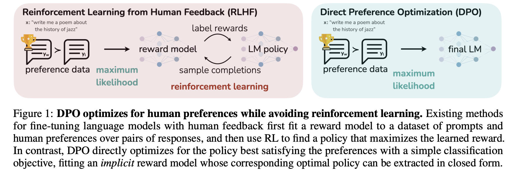

基于论文《Direct Preference Optimization: Your Language Model is Secretly a Reward Model》详解

---

## 一、共同的优化目标

PPO 和 DPO 在数学上共享同一个优化问题（论文 Eq.(3)）：

$$
\max_{\pi_\theta} \mathbb{E}_{x \sim \mathcal{D}, y \sim \pi_\theta(y|x)} [r(x,y)] - \beta \mathbb{D}_{KL}[\pi_\theta(y|x) \| \pi_{\text{ref}}(y|x)] \tag{3}
$$

**Eq.(3) 的四层拆解：**

1. **\(\max_{\pi_\theta}\)**：调整策略模型参数，使目标函数最大化。

2. **\(\mathbb{E}_{x \sim \mathcal{D}, y \sim \pi_\theta(y|x)}\)**：从数据集中采样提示词 \(x\)，再从**当前策略**采样回复 \(y\)。**严格来说，这种期望形式在数学上要求从当前策略在线采样才能无偏估计。**

3. **\(r(x,y)\)**：奖励模型对 \((x, y)\) 给出的绝对分数，反映人类偏好程度。

4. **\(-\beta \mathbb{D}_{KL}\)**：KL 惩罚项。若当前策略 \(\pi_\theta\) 偏离参考模型 \(\pi_{\text{ref}}\)（SFT 模型），则受罚。系数 \(\beta\) 控制惩罚强度，防止 Reward Hacking。

### 关键分岔点：PPO 与 DPO 对 Eq.(3) 的求解路径

### 1. PPO（On-Policy，直接执行式采样）

**PPO 的做法**：
- **严格遵循 Eq.(3) 的期望形式**，每一步更新前都从**当前最新策略** \(\pi_\theta\) 中在线采样，获得真实的 \(y \sim \pi_\theta(y|x)\)。
- 然后通过 GAE 估计优势 \(A_t\)，用强化学习（Actor-Critic）逐步逼近最优解。

**On-Policy 代价**：
- 每轮更新前必须重新采样（`replay_buffer` 用完即弃）。
- 需同时加载 4 个模型（Policy、Reference、Reward、Value）。
- 超参数敏感，训练不稳定。

### 2. DPO（Off-Policy，数学变换代替采样）

**DPO 的核心洞察**：
- Eq.(3) 中的期望符号 \(\mathbb{E}_{y \sim \pi_\theta(y|x)}\) 虽然写作从当前策略采样，但 DPO **并不执行这个采样过程**。
- 相反，DPO 利用 **Eq.(4) 的闭式解**（即 Eq.(3) 的最优策略解析形式），将 Eq.(3) **等价地转化**为仅依赖离线偏好数据 \( \mathcal{D} = \{x, y_w, y_l\} \) 的损失函数 Eq.(7)。

**Off-Policy 含义**：
- 训练数据（\(y_w, y_l\)）来自一个**固定的、离线**的偏好数据集（通常由 SFT 模型预先采样并标注），与当前策略无关。
- 在 DPO 训练过程中，策略模型 \(\pi_\theta\) 在不断更新，但数据来源（参考策略 \(\pi_{\text{ref}}\) 和人类偏好）保持固定不变。**“采样的老师”（SFT 模型）与“更新的学生”（当前策略）不是同一个**，因此是 Off-Policy。

**Off-Policy 优势**：
- 只需加载 2 个模型（Policy、Reference），无 Value 和 Reward 模型。
- 一次离线采样，多轮监督学习，数据可重复使用（一鱼多吃）。
- 训练稳定，几乎无需调参。

---

## 二、PPO 路径：显式奖励模型 + 在线 RL

### 2.1 前置步骤：奖励建模（Eq.(1) 与 Eq.(2)）

人类偏好由 Bradley-Terry（BT）模型描述（Eq.(1)），表示给定提示 \(x\) 时，回答 \(y_1\) 优于 \(y_2\) 的概率：

$$p^*(y_1 \succ y_2 | x) = \frac{\exp(r^*(x,y_1))}{\exp(r^*(x,y_1)) + \exp(r^*(x,y_2))} \tag{1}$$

**Eq.(1) 的拆解：**

1. **\(r^*(x,y)\)**：隐性的“真实”人类偏好打分，无法直接观测。

2. **\(\exp(r)\)**：BT 模型将胜率建模为奖励值指数的相对比例。若 \(y_1\) 的奖励远高于 \(y_2\)，胜率趋近 1；反之趋近 0。

为了拟合真实打分，训练参数化奖励模型 \(r_\phi\)，通过最大化偏好数据的似然（最小化负对数似然），得到奖励模型损失（Eq.(2)）：

$$\mathcal{L}_R(r_\phi) = -\mathbb{E}_{(x,y_w,y_l)\sim \mathcal{D}}[\log \sigma (r_\phi (x,y_w) - r_\phi (x,y_l))] \tag{2}$$

**Eq.(2) 的拆解：**

1. **\(y_w, y_l\)**：赢家（preferred）和输家（dispreferred）回复。

2. **\(r_\phi(x,y_w) - r_\phi(x,y_l)\)**：赢家得分减输家得分，希望差值尽可能大。

3. **\(\sigma(\cdot)\)**：Sigmoid 函数，将差值映射到 \((0,1)\)，代表模型认为 \(y_w\) 优于 \(y_l\) 的概率。

4. **\(-\log\)**：负对数似然。差值越大（判断越正确），损失趋近 0；差值越小或为负（判断错误），损失急剧增大。本质是二分类逻辑回归。

### 2.2 PPO 阶段

有了 \(r_\phi\) 后，PPO 通过在线采样和 GAE 优势估计，逐步对策略参数 \(\theta\) 做梯度上升，最大化 Eq.(3)。PPO 将 KL 惩罚直接混入每一步的即时奖励：

$$r_t = r_\phi(x, y_{<t}) - \beta \log \frac{\pi_\theta(y_t | x, y_{<t})}{\pi_{\text{ref}}(y_t | x, y_{<t})}$$

**含义**：若当前策略生成该 Token 的概率高于 SFT 模型，即时奖励被削减。这导致价值网络（Critic）需拟合“人类偏好 + KL 偏移”的复合信号，GAE 估计方差大、训练极不稳定。

**PPO 的代价**：
- 需加载 4 个模型（Policy、Reference、Reward、Value），显存开销极高。
- 超参数敏感，容易模式坍塌。
- 在线采样和优势估计计算昂贵。

---

## 三、DPO 路径：隐式奖励 + 离线监督学习

### 3.1 核心洞察 1：Eq.(3) 的最优策略有闭式解（Eq.(4)）

对于任意奖励函数 \(r\)，Eq.(3) 的最优策略 \(\pi_r\)（即平衡“高分”与“不跑偏”的最佳模型）的解析形式为（论文 Eq.(4)）：

$$\pi_r(y|x) = \frac{1}{Z(x)} \pi_{\text{ref}}(y|x) \exp\left(\frac{1}{\beta} r(x,y)\right) \tag{4}$$

**Eq.(4) 的四层拆解：**

1. **\(\exp(\frac{1}{\beta} r)\)**：奖励越高的回复 \(y\)，概率呈指数级放大。\(\beta\) 控制放大倍数——\(\beta\) 越小，模型越激进地追逐高分。

2. **\(\pi_{\text{ref}}\)**：作为基础概率锚点，防止模型彻底脱离人类语言分布。

3. **\(Z(x) = \sum_y \pi_{\text{ref}}(y|x) \exp(\frac{1}{\beta} r(x,y))\)**：配分函数，确保所有候选 \(y\) 的概率之和为 

### 3.2 核心洞察 2：用策略表示奖励（Eq.(5)）

DPO 不计算 \(Z(x)\)，而是将 Eq.(4) 反解，用最优策略 \(\pi_r\) 表达奖励函数 \(r\)（论文 Eq.(5)）：

$$r(x,y) = \beta \log \frac{\pi_r(y|x)}{\pi_{\text{ref}}(y|x)} + \beta \log Z(x) \tag{5}$$

**Eq.(5) 的三层拆解：**

1. **\(\beta \log \frac{\pi_r}{\pi_{\text{ref}}}\)**：语言模型策略自身就是一个隐式奖励模型。这一项只依赖策略模型与参考模型的对数概率比。

2. **\(+\beta \log Z(x)\)**：配分函数的对数，虽难计算，但注意它**仅依赖提示词 \(x\)，与具体回复 \(y\) 无关**。

3. **关键意义**：原本需要外部神经网络 \(r_\phi\) 给出的奖励，现在可以用策略 \(\pi_r\) 本身来替代。

### 3.3 核心洞察 3：代入 BT 模型，配分函数抵消（Eq.(6)）

将 Eq.(5) 代入 BT 偏好模型 Eq.(1)，计算两个回复的奖励差，配分函数 \(Z(x)\) 在做减法时完全抵消（论文 Eq.(6)）：

$$p^*(y_1 \succ y_2 | x) = \sigma\left( \beta \log \frac{\pi^*(y_1|x)}{\pi_{\text{ref}}(y_1|x)} - \beta \log \frac{\pi^*(y_2|x)}{\pi_{\text{ref}}(y_2|x)} \right) \tag{6}$$

**解读**：人类偏好概率可以**仅用最优策略 \(\pi^*\) 和参考策略 \(\pi_{\text{ref}}\) 的对数概率比之差**来表示，完全不需要显式的奖励模型。

### 3.4 最终 DPO 损失函数（Eq.(7)）

直接对策略模型 \(\pi_\theta\) 最大化 Eq.(6) 的似然，取负对数得到最终损失（论文 Eq.(7)）：

$$\mathcal{L}_{\text{DPO}}(\pi_\theta;\pi_{\text{ref}}) = -\mathbb{E}_{(x,y_w,y_l)\sim \mathcal{D}} \left[ \log \sigma \left( \beta \log \frac{\pi_\theta(y_w|x)}{\pi_{\text{ref}}(y_w|x)} - \beta \log \frac{\pi_\theta(y_l|x)}{\pi_{\text{ref}}(y_l|x)} \right) \right] \tag{7}$$

**Eq.(7) 的四层拆解：**

1. **隐式奖励**：\(\hat{r}_\theta(x,y) = \beta \log \frac{\pi_\theta(y|x)}{\pi_{\text{ref}}(y|x)}\)，策略模型自带的打分器，无需外部 RM。

2. **括号内**：赢家的隐式奖励减输家的隐式奖励。优化目标是让这个差值尽可能大。

3. **\(\sigma\) + \(-\log\)**：二分类交叉熵。若差值很大（排序正确），损失趋近 0；若差值很小或为负（排序错误），损失急剧增大。

4. **本质**：Eq.(7) 的形式和 Eq.(2)（训练奖励模型的损失）完全一致，但优化目标直接是最终策略 \(\pi_\theta\)，将“奖励建模”和“策略优化”合并为一步，无需价值网络和在线采样。

### 3.5 DPO 梯度更新（Eq.(8)）

对 Eq.(7) 求导，得到 DPO 梯度（论文 Eq.(8)）：

$$\nabla_\theta \mathcal{L}_{\text{DPO}} = -\beta \mathbb{E} \left[ \underbrace{\sigma(\hat{r}_\theta(y_l) - \hat{r}_\theta(y_w))}_{\text{动态权重 } w} \left( \nabla_\theta \log \pi_\theta(y_w) - \nabla_\theta \log \pi_\theta(y_l) \right) \right] \tag{8}$$

**Eq.(8) 的四层拆解：**

1. **强化好回答**：\(\nabla_\theta \log \pi_\theta(y_w)\) 前为负号，梯度下降时增加 \(y_w\) 的对数概率。

2. **惩罚坏回答**：\(-\nabla_\theta \log \pi_\theta(y_l)\) 前为负号，梯度下降时降低 \(y_l\) 的对数概率。

3. **动态权重 \(w = \sigma(\hat{r}_\theta(y_l) - \hat{r}_\theta(y_w))\)**：
   - 若模型把坏回答的隐式奖励排得比好回答高，差值较大，sigmoid 接近 1，梯度猛烈修正。
   - 若排序正确，差值较小，sigmoid 趋近 0，更新自动放缓。

4. **意义**：无需显式 KL 约束项，\(\beta\) 已内含在隐式奖励中。这种自适应加权机制使 DPO 极其稳定，无需 PPO 的 Clip 机制。

---
## DPO 分步总结

| 步骤 | 对应环节 | **依赖模型** | **计算公式（标号/简写）** | **总结（DPO 核心流程）** |
| :--- | :--- | :--- | :--- | :--- |
| **①** | **离线偏好数据构建 + 参考策略初始化** | **参考策略（\( \pi_{\text{ref}} \)，SFT 模型）采样候选回复 + 人类/规则标注偏好** | 构建数据集： \( \mathcal{D} = \{x, y_w, y_l\} \) | **静态数据准备**：用 SFT 模型对每个提示词采样多个回复，通过人工或规则标注偏好对（赢家 \( y_w \) / 输家 \( y_l \)）。此阶段完成后，模型参数**完全冻结**，后续训练不再进行在线采样。 |
| **②** | **前向计算（隐式奖励获取）** | **当前策略（\( \pi_\theta \)） + 参考模型（\( \pi_{\text{ref}} \)）** | **隐式奖励**：（公式 5 变体） | **双模型前向**：分别用当前策略 \( \pi_\theta \) 和固定参考模型 \( \pi_{\text{ref}} \) 对偏好数据中的赢家 \( y_w \) 和输家 \( y_l \) 计算对数概率，进而得出两者的“隐式奖励”差值。**不需要 Reward 模型和 Value 网络**。 |
| **③** | **DPO 损失计算（核心优化目标）** | **当前策略（\( \pi_\theta \)） + 参考模型（\( \pi_{\text{ref}} \)）** | **公式 (7) 损失**（二分类交叉熵） | **二分类排序损失**：强逼赢家的隐式奖励显著高于输家（差值越大损失越小）。该损失函数**内嵌了 KL 约束**（通过 \( \beta \) 调节隐式奖励的尺度），无需像 PPO 那样在奖励里额外减 KL。 |
| **④** | **策略反向传播（梯度更新）** | **新策略（\( \pi_\theta \) 更新主体） + 参考模型（固定，仅用于计算隐式奖励）** | **公式 (8) 梯度**（自适应加权梯度） | **自适应梯度下降**： ① **增优**：增加 \( y_w \) 的生成概率； ② **减劣**：降低 \( y_l \) 的生成概率； ③ **动态权重**：排序越错（把输家排得比赢家还高），更新力度越大；排序正确则自动放缓（不瞎改）。 **流程为离线监督学习（Off-Policy），一步到位，无需多轮采样。** |

---

### 📐 公式速查

**隐式奖励定义（公式 5 变体）**：
\[
\hat{r}_\theta(x,y) = \beta \log \frac{\pi_\theta(y|x)}{\pi_{\text{ref}}(y|x)}
\]

**DPO 损失函数（公式 7）**：
\[
\mathcal{L}_{\text{DPO}} = -\mathbb{E}_{(x,y_w,y_l)} \left[ \log \sigma \left( \hat{r}_\theta(x,y_w) - \hat{r}_\theta(x,y_l) \right) \right]
\]

**DPO 梯度更新（公式 8）**：
\[
\nabla_\theta \mathcal{L}_{\text{DPO}} = -\beta \mathbb{E} \left[ \sigma(\hat{r}_\theta(y_l) - \hat{r}_\theta(y_w)) \cdot \left( \nabla_\theta \log \pi_\theta(y_w) - \nabla_\theta \log \pi_\theta(y_l) \right) \right]
\]

---

## 五、总结对比表

| 对比维度 | **PPO（表）** | **DPO（表）** |
| :--- | :--- | :--- |
| **步骤①** | 用**当前策略**在线采样，同时生成 \( r_t \) 和 \( V \) | 用**固定 SFT 模型**离线采样，仅准备静态偏好数据 |
| **所需模型** | Policy + Reference + Reward + Value（4个） | Policy + Reference（2个） |
| **奖励来源** | 外部神经网络 \( r_\phi \)（需额外训练） | 策略自身的隐式奖励 \( \beta \log \frac{\pi_\theta}{\pi_{\text{ref}}} \) |
| **核心损失** | \( \text{Clip} \) + MSE（需 GAE 估计优势） | 二分类交叉熵（直接优化偏好排序） |
| **更新依据** | 优势 \( A_t \)（依赖 Value 网络） | 动态权重 \( \sigma(\hat{r}_\theta(y_l) - \hat{r}_\theta(y_w)) \)（自调节） |
| **策略更新性质** | **On-Policy**（数据用完即弃） | **Off-Policy**（固定离线数据集） |
---
