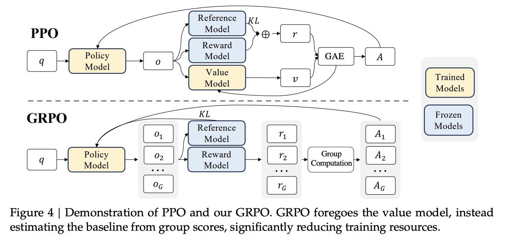

《DeepSeekMath: Pushing the Limits of Mathematical Reasoning in Open Language Models》详解。
GRPO 是 DeepSeek 针对 PPO（近端策略优化）在 LLM 训练中的显存占用和训练不稳定问题，提出的一种**轻量级、高效的在线强化学习变体**。它最核心的改进是：**彻底舍弃了与策略模型同等大小的价值网络（Critic / Value Network）**。

---

### 1. 为什么舍弃 PPO 中的 Critic？（动机与痛点）

在标准 PPO 中，需要同时加载 4 个模型：**Actor（策略）**、**Reference（参考）**、**Reward（奖励）**、**Critic（价值）**。

- **显存灾难**：Critic 通常与 Actor 参数量相当（例如都是 7B），增加近一倍的显存和计算负担。
- **训练困难**：LLM 生成文本时，Reward Model 通常只对**最后一个 Token（EOS）** 给出总分。而 Critic 需要为**每一个 Token** 预测价值 \( V(s_t) \)。在没有中间奖励的情况下，训练准确的逐 Token 价值函数极其困难（方差大、不准确），导致 GAE（广义优势估计）计算的优势值 \( A_t \) 噪声很大。

**GRPO 的解法**：抛弃 Critic，不再依赖网络去估计“绝对价值”，而是利用同一问题下的**多个采样输出之间的“相对优劣”** 来构建基线（Baseline）。

---

### 2. 核心机制：组内相对优势估计（Group-wise Relative Advantage）

这是 GRPO 的灵魂，对应论文第 4.1.2 和 4.1.3 节。

**操作流程**：
对于每一个问题 \( q \)：
1. **采样组（Group Sampling）**：从旧策略 \( \pi_{\theta_{old}} \) 中采样一组（Group，数量为 \( G \)，论文取 64 个）不同的输出 \( \{o_1, o_2, ..., o_G\} \)。
2. **打分**：用 Reward Model 对这 \( G \) 个输出分别打分，得到奖励集合 \( \mathbf{r} = \{r_1, r_2, ..., r_G\} \)。
3. **相对归一化（核心基线）**：计算该组奖励的均值（mean）和标准差（std）。将每个输出的奖励**减去组均值并除以组标准差**，得到归一化后的相对奖励 \( \tilde{r}_i \)。
   - **不再需要 \(V(s_t)\)**：GRPO 直接用这个组内相对奖励作为“优势”的替代信号。这利用了 Reward Model 本身偏好“相对比较”的训练特性（因为 RM 本就是基于 Pairwise Ranking 训练的）。

#### 结果监督（Outcome Supervision， OS）
如果只用最终答案的正确性作为奖励（Outcome Reward），GRPO 将归一化后的最终得分 \( \tilde{r}_i \) 直接赋给该输出序列的**所有 Token**，即：
\[
\hat{A}_{i,t} = \tilde{r}_i = \frac{r_i - \text{mean}(\mathbf{r})}{\text{std}(\mathbf{r})}
\]
> 这意味着：如果这组里有 3 个答对了，1 个答错了，答对的中得分最高的会被强化，得分最低的即使答对了也会被轻微惩罚（因为相对分数为负）。

---

### 3. 目标函数与 KL 散度的处理（公式解析）

GRPO 的目标函数（论文公式 3）在 PPO 裁剪目标的基础上，做了两点重要调整：

\[
\mathcal{I}_{GRPO}(\theta) = \mathbb{E}\left[ \frac{1}{G}\sum_{i=1}^G \frac{1}{|o_i|}\sum_{t=1}^{|o_i|} \left( \min \left[ \frac{\pi_\theta}{\pi_{\theta_{old}}} \hat{A}_{i,t}, \text{clip}(\frac{\pi_\theta}{\pi_{\theta_{old}}}, 1\pm\epsilon) \hat{A}_{i,t} \right] - \beta \mathbb{D}_{KL}[\pi_\theta || \pi_{ref}] \right) \right]
\]

#### 关键差异点 1：KL 散度移出 Reward，直接加入 Loss
- **PPO 的做法**（公式 2）：将 KL 惩罚作为负项直接加在**即时奖励 \( r_t \)** 上（\( r_t = r_\phi - \beta KL \)）。这会改变奖励的绝对值分布，增加优势估计的复杂度。
- **GRPO 的做法**（公式 3 右半部分）：不在奖励中加 KL，而是将 KL 散度作为**正则项（Regularization）** 直接写在损失函数中减去。这样 Reward Model 打出的原始分保持不变，仅作为组内排序的依据。

#### 关键差异点 2：无偏 KL 估计（公式 4）
为了计算 KL 散度，GRPO 使用了一个“无偏估计器”：
\[
\mathbb{D}_{KL} = \frac{\pi_{ref}}{\pi_\theta} - \log \frac{\pi_{ref}}{\pi_\theta} - 1
\]
（该数值保证永远为正），而不是常见的 \( \log(\pi_\theta / \pi_{ref}) \)。

---

### 4. 迭代式 GRPO（Iterative RL）

论文第 4.1.4 节引入了迭代机制（Algorithm 1）：
1. **参考模型更新**：每一轮迭代开始时，将当前的策略模型设为新的参考模型（`ref = policy`），锁住作为 KL 锚点。
2. **奖励模型持续训练**：利用当前策略采样生成的新数据，结合历史数据（Replay Mechanism 保留 10%），继续训练 Reward Model。
3. **重复**：随着策略变强，Reward Model 也在不断进化，避免出现“奖励作弊（Reward Hacking）”。

---
### 5. GRPO 分步总结

| 步骤 | 对应环节 | **依赖模型** | **计算公式** | **总结（与 PPO 的核心差异）** |
| :--- | :--- | :--- | :--- | :--- |
| **①** | **组采样 + 奖励/KL生成** | **旧策略（为每个问题采样 G 个输出） + Ref模型（KL参考） + Reward模型（打分）** | 结果监督下，KL 惩罚通常直接加入损失（公式3）| **舍弃 Critic（V）**：无需加载价值网络。每组采样多个输出（如 \( G=64 \)），Reward模型给出每个完整输出的最终分数。 |
| **②** | **组内相对优势估计** | **旧策略 + Reward模型（组内分数）** | **结果监督（OS）**： \( \hat{A}_{i,t} = \tilde{r}_i = \frac{r_i - \text{mean}(\mathbf{r})}{\text{std}(\mathbf{r})} \) | **替代 GAE（TD+V）**：不用计算 \( \delta_t \) 和 \( V \)，直接用**同组输出的平均分作为基线**，归一化后的相对分直接作为所有 Token 的优势。 |
| **③** | **Actor 反向传播** （内含裁剪 + KL 正则） | **新策略（更新主体） + 旧策略（参考比率） + Ref模型（KL锚点）** | **目标函数（公式3）** **无偏 KL（公式4）**： \( \frac{\pi_{ref}}{\pi_\theta} - \log\frac{\pi_{ref}}{\pi_\theta} - 1 \) | **KL 移入 Loss**：不把 KL 加在即时奖励里（避免了 PPO 中奖励尺度被干扰的问题），而是作为**正则项**直接减在损失函数上，并采用无偏估计器降低方差。 |
| **④** | ~~Critic 反向传播~~ | ❌ **无 Critic 模型** | ❌ 无 | **彻底移除 Critic 更新**：大幅节省显存和计算，避免训练价值网络不稳定的问题。 |
---

### 6. 总结：PPO vs GRPO 对比速查

| 特性 | **PPO (Proximal Policy Optimization)** | **GRPO (Group Relative Policy Optimization)** |
| :--- | :--- | :--- |
| **价值网络 (Critic)** | **需要**（参数量与 Actor 相同，显存翻倍） | **舍弃**（无需加载，极大节省显存） |
| **基线 (Baseline)** | 由 Critic 网络预测的\(V(s_t)\)（绝对值估计） | 由同一问题下**采样组 G 的平均分**决定（相对值估计） |
| **优势计算** | GAE（需要逐 Token 的 V 值，噪声大） | 组内归一化奖励（Result 或 Process 监督） |
| **KL 散度处理** | 作为惩罚项加在**即时奖励**中 | 作为正则项直接加在**损失函数**中（无偏估计） |
| **奖励模型更新** | 通常固定 | **可迭代更新**（随策略进化） |
| **核心优势** | 理论方差小（但 LLM 中 Critic 不准） | **内存友好、训练稳定、与 RM 比较特性契合** |